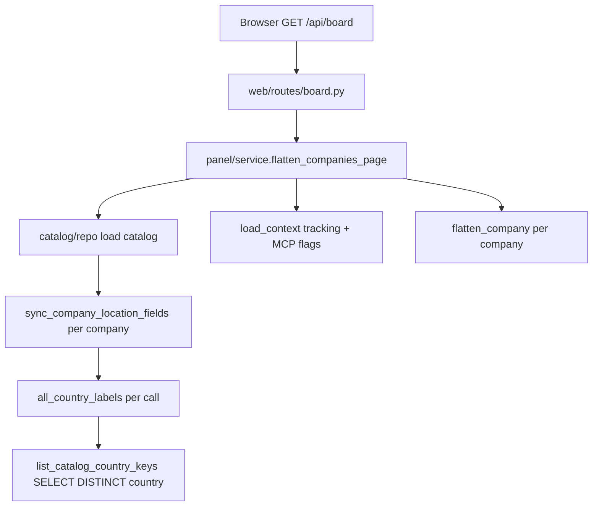

# When the board looked hung: a performance postmortem

**Last updated:** 2026-07-08  
**Status:** resolved (local panel + EC2 Postgres dev setup)

In July 2026 the local job board appeared frozen: the server was up, but `GET /api/board` blocked for tens of seconds before returning anything. Germany was worst (~90s). The real cause was not “remote Postgres is slow” or job-description payloads — it was **hundreds of uncached Postgres round-trips** hidden inside innocent-looking location-label helpers.

Related: [board.md](board.md), [board-read-model-proposal.md](board-read-model-proposal.md), [catalog-pattern.md](catalog-pattern.md), [mcp-application.md](mcp-application.md), [operations/ec2-panel.md](../operations/ec2-panel.md)

---

## Executive summary

| | |
|---|---|
| **Symptom** | Panel on port 5051 looked hung; board API blocked 30–90+ seconds (Germany worst). |
| **User impact** | Board unusable with `.env` pointing at EC2 Postgres; admin dashboard also brutal (~2+ min). |
| **Root cause** | `sync_company_location_fields()` called `all_country_labels()` hundreds of times per request. Each call ran `list_catalog_country_keys()` — a full round-trip to Postgres — with **no cache**. |
| **Measured** | 678 DB round-trips for 98 German companies; ~44s in location sync alone; SQL for jobs was only ~0.7s. |
| **Misleading factors** | Jul 7 MCP `description_text` backfill, default `sort=newest` full-country flatten, and a failed “preview pass” optimization that doubled work. |
| **Outcome** | Germany board ~**1.7s** after fix (was ~89–103s). |

---

## What we saw

Local panel with `DATABASE_URL` pointing at remote EC2 Postgres (`<ELASTIC_IP>` in local `aws-postgres.env`, gitignored). Timings measured on `GET /api/board` page 1, default `sort=newest`:

| Request | Before | After fix |
|---------|--------|-----------|
| Armenia board | ~3s (tolerable) | ~0.6s |
| Netherlands board | ~32s | ~0.6s |
| Germany board | ~58–89s | ~1.7s |
| Admin dashboard | ~143s | Fast shell; pipeline stats load async |

Two different failures were easy to confuse:

1. **Port 5051 already in use** — starting the panel again prints `Address already in use`. The first instance is fine; open `http://127.0.0.1:5051`.
2. **Slow API** — the overlay stays on “Loading board…” because the server is still working, not deadlocked.

---

## Architecture context

The board is not a table read. It is a **derived read model** built on every request:

```text
companies + matching_jobs          (catalog — shared)
  + job_tracking + company_tracking + job_status_events + mcp_applications  (per user)
  → flatten_company()              (merge, bucket partition, orphans)
  → panel filter predicates
  → sort (newest = max job.fetched on open-board jobs)
  → paginate visible companies
```

See [catalog-pattern.md](catalog-pattern.md) and [board-read-model-proposal.md](board-read-model-proposal.md).



---

## Timeline: what made it visible

| When | Change | Effect |
|------|--------|--------|
| Earlier v2 | `sort=newest` scans full country, sorts in Python | Always O(all companies); masked while catalog path was fast |
| **2026-07-07** (`33beee5`, `f47871a`) | MCP: store `description_text` in Postgres | Heavier job rows if `SELECT *`; real but secondary (~2.7s vs 0.14s for Germany jobs query) |
| **2026-07-07+** | Local dev uses EC2 Postgres | Every uncached query pays WAN latency (~60ms × N) |
| **2026-07-08** (first fix attempt) | Stats-only columns + `preview_board_company` two-phase sort | **Regression:** preview duplicated `partition_stored_jobs`; total ~103s |
| **2026-07-08** (real fix) | Cache `all_country_labels()`; remove preview pass | Germany ~1.7s |

The bug was **latent** long before July 2026. EC2 dev + more catalog work made each repeated query expensive enough to notice.

---

## Why it was confusing

We had just shipped MCP job descriptions, refactored catalog reads, and were debugging unrelated product bugs (restore from not-for-me, seen state on EC2). Natural suspects:

1. **“It’s remote Postgres”** — true latency multiplier, not the primary bug.
2. **“Descriptions are huge now”** — Germany had ~3.8 MB of `description_text`; board used `SELECT *` on jobs. Worth fixing, but Germany catalog SQL was **0.67s** without descriptions.
3. **“Newest sort loads everything”** — architectural cost (~40s flatten for 98 companies once location sync was fixed). Secondary.
4. **“The panel won’t start”** — often port 5051 already bound.

Profiling split the problem cleanly:

```text
meta 0.07s | companies 0.14s | jobs 0.15s | total SQL 0.67s
post-process (sync_company_location_fields × 98) 43.97s
```

Postgres was fast. Python post-processing was not.

---

## Root cause

Every company loaded from the catalog passes through `sync_company_location_fields()` in `relocation_jobs/catalog/repo.py` (`load_catalog_for_countries`, `load_catalog_companies_page`).

That calls `normalize_locations()` in `relocation_jobs/core/location_tags.py`, which for each city:

- `normalize_location()` → `country_label()` → `all_country_labels()`
- `normalize_location()` → `supported_country_keys()` → `all_country_labels()` again
- `_strip_country_suffix()` → `sorted(all_country_labels().values(), ...)` on every suffix strip

Before the fix, `all_country_labels()` looked innocent but was not cached:

```python
def all_country_labels() -> dict[str, str]:
    merged = dict(load_custom_countries())  # cached after first call
    for key in list_catalog_country_keys():  # DB query EVERY call
        if key not in merged:
            merged[key] = key.replace("-", " ").title()
    return merged
```

`list_catalog_country_keys()` in `relocation_jobs/catalog/custom_countries.py` runs:

```sql
SELECT DISTINCT country FROM companies
UNION
SELECT DISTINCT country FROM country_meta
```

**Counter during one Germany board load:** `all_country_labels` / `list_catalog_country_keys` called **678 times** for **98 companies**.

`load_custom_countries()` was cached. `all_country_labels()` was not. `country_label()` is used everywhere — filters, display, location normalization — so the hot path inside a per-company loop became catastrophic over a remote database.

---

## False leads (investigation notes)

| Suspect | Verdict |
|---------|---------|
| Remote EC2 Postgres | Multiplier (~60ms/query × 678), not root cause |
| `description_text` on board reads | Fixed; secondary (~20× on raw job query) |
| `sort=newest` full-country flatten | Architectural debt; ~1–2s after cache fix |
| Restore / seen UI bugs | Separate issues; unrelated to load time |
| Preview-pass “optimization” | **Made it worse** (~103s) by duplicating flatten work |

---

## Secondary issues (also fixed)

| Issue | Location | Fix |
|-------|----------|-----|
| Job descriptions on list reads | `catalog/repo.py` — `_JOB_LIST_COLUMNS`, `_job_stats_row` | Board pagination omits `description_text` |
| Admin dashboard blocked on global stats | `admin/service.py`, `static/js/admin.js` | `panel_stats: null` on dashboard; async `GET /api/admin/panel-stats` |
| MCP blobs on every board load | `mcp/repo.py` — `load_application_summaries` | Select boolean flags, not `pdf_bytes` / `tailored_tex` |
| Failed preview pass | `panel/service.py` | Reverted; single flatten + sort |

---

## The fix

### Primary — cache country labels

In `relocation_jobs/core/location_tags.py`:

- Module-level `_country_labels_cache` and `_country_suffix_labels_cache`
- `all_country_labels()` returns cached dict after first build
- `invalidate_country_labels_cache()` on custom-country and catalog writes
- `invalidate_country_cache()` in `relocation_jobs/catalog/cache.py` clears label cache when catalog changes
- `_sorted_country_suffix_labels()` avoids re-sorting label values per city

**After (Germany, EC2 Postgres):**

| Step | Time |
|------|------|
| `sync_company_location_fields` × 98 | 0.51s (was 44s) |
| `load_catalog_for_countries` | 0.33s (was 42s) |
| Full board `sort=newest` page 1 | 1.7s (was 89–103s) |

### Board load path

- `load_catalog_for_countries(..., include_descriptions=False)` for activity sort
- Single `flatten_company` pass per visible company, then sort and slice (no preview pass)
- `load_catalog_companies_page` uses stats-only job columns for `sort=name` streaming path

### Verification

```bash
pytest tests/web/test_board_api.py tests/panel/test_hide_empty.py \
  tests/web/test_admin_e2e.py tests/catalog/test_repo.py -o addopts=
```

Restart local panel after pulling changes:

```bash
lsof -ti:5051 | xargs kill -9
PANEL_SCRAPE_ENABLED=1 python3 scripts/panel_server.py
```

---

## Lessons

**Profile before theorizing.** Split SQL time vs Python post-process. Do not assume “remote DB” or “big payloads” without timers on each phase.

**Never put remote I/O inside hot per-row helpers.** `country_label()` looks trivial. Inside `sync_company_location_fields` in a loop over every company on the board, it became 678× Postgres.

**Cache at the merged read-model boundary.** `load_custom_countries()` was cached; `all_country_labels()` merged custom labels with catalog country keys and was not.

**Optimizations can regress.** The preview pass ran nearly all of `partition_stored_jobs` on every company, then ran full `flatten_company` again on the page slice. Always benchmark after changes.

**Separate symptoms.** Port in use vs slow API. Restore bug vs load bug. Seen on EC2 vs local hang.

**Do not put infrastructure secrets in docs.** This repo is public — use placeholders (`<ELASTIC_IP>`, `PASSWORD`, `https://kuchup.com`) not real Elastic IPs, connection strings, or passwords in committed markdown. Keep live values in gitignored `.env` / `aws-postgres.env` only.

---

## Future work (not done)

- CQRS / projection table ([board-read-model-proposal.md](board-read-model-proposal.md)) so `sort=newest` does not flatten the full country on every page load
- `/api/jobs` export path still uses `SELECT *` + descriptions via `_load_country_from_db`
- Local Postgres in `.env` for fast iteration (see [.env.example](../../.env.example))

---

## Files touched

| File | Role |
|------|------|
| `relocation_jobs/core/location_tags.py` | Label cache + suffix label cache |
| `relocation_jobs/catalog/cache.py` | Invalidate labels on catalog write |
| `relocation_jobs/catalog/repo.py` | Stats-only job columns for board pagination |
| `relocation_jobs/panel/service.py` | Board load path (no preview pass) |
| `relocation_jobs/panel/flatten.py` | `preview_board_company` (tests / future use) |
| `relocation_jobs/mcp/repo.py` | Lightweight `load_application_summaries` |
| `relocation_jobs/admin/service.py` | Dashboard no longer embeds heavy `panel_stats` |
| `relocation_jobs/static/js/admin.js` | Async `/api/admin/panel-stats` |
| `tests/panel/test_preview_board.py` | Preview helper correctness |
| `tests/catalog/test_repo.py` | Board pagination omits descriptions |
| `tests/web/test_admin_e2e.py` | Dashboard defers panel stats |
