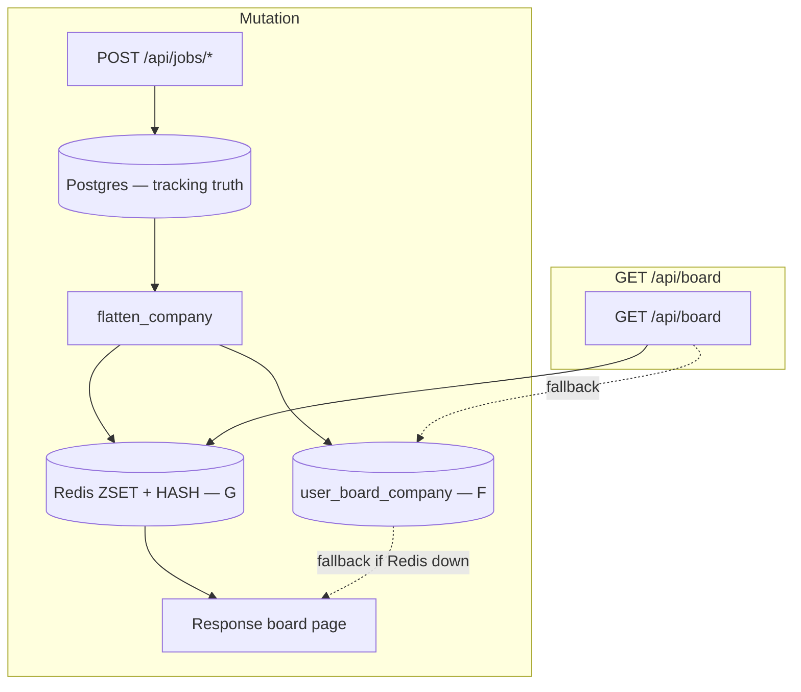
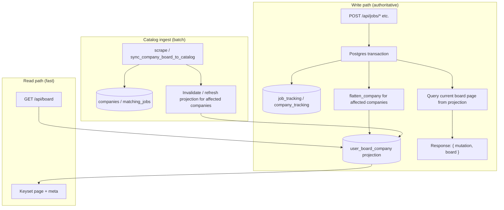

# Board read model — performance proposal

**Status:** proposal (not approved)  
**Last updated:** 2026-07-03 (Redis / leaderboard option added)  
**Authors:** architecture discussion (agent + owner review pending)

Related: [board.md](board.md), [catalog-pattern.md](catalog-pattern.md), [business-rules.md](business-rules.md), [rules.md](rules.md), [stats.md](stats.md)

---

## Summary

The main job board (`GET /api/board`) is slow (~2s in practice) because every request **recomputes a derived view** from catalog + per-user tracking, then paginates. Many mutations (not-for-me, reject, apply, hide-empty side effects) **must** refresh that global view — a local client patch alone cannot be correct when pagination and “newest first” sort are active.

**Recommended direction (default):** keep Postgres as the **only source of truth** for tracking and catalog; add a **per-user board projection** updated synchronously on writes (CQRS-lite); serve paginated reads from that projection with **keyset (cursor) pagination**; return an **authoritative board slice** in mutation responses so the client never guesses.

**Alternative under decision (Option G):** after the projection exists (or in parallel), store the **same derived board** in **Redis** (ZSET for company rank + HASH/JSON for card payloads) so `GET /api/board` never scans Postgres. Postgres still commits **before** Redis is updated on user mutations; Redis is a **derived read cache**, not persistence for tracking.

**Not recommended:** Elasticsearch for board state; client-authoritative filter/sort/pagination; **Redis-first UI with async Postgres writes** (eventual consistency on apply/reject/not-for-me); PostgreSQL `pg_ivm` / native materialized views as the primary mechanism (wrong fit for this merge logic).

**Decision needed:** Option **F** (Postgres projection only) vs **F + G** (Postgres truth + Redis read path) — see [Decision: projection store](#decision-projection-store-f-vs-g).

---

## Problem statement

### What the board actually is

The panel does not read a table. It reads a **read model** built at request time:

```text
companies + matching_jobs          (catalog — shared)
  + job_tracking + company_tracking + job_status_events + mcp_applications  (per user)
  → flatten_company()              (merge, bucket partition, orphans)
  → panel filter predicates        (visa, hide applied, hide empty, …)
  → sort (newest = max job.fetched on open-board jobs bucket)
  → paginate visible companies
```

This is already documented as “overlay / projection at read time” in [catalog-pattern.md](catalog-pattern.md). The implementation lives in `panel/flatten.py`, `panel/service.py`, and `web/routes/board.py`.

### Why mutations force a full board refresh

Example (from product requirements): user marks the **newest** open role at company #26 as **wrong location** or **expired** (not-for-me).

1. Tracking write moves the job to the `not_for_me_jobs` bucket ([business-rules.md](business-rules.md) rules 8, 10).
2. `newest_job_fetched` is recomputed from the **open `jobs` bucket only** (`shared/timestamps.company_newest_job_fetched`).
3. Company sort position on “newest first” may drop; with `hide_empty`, the company may **leave the visible set**.
4. Pagination totals and page membership change — a company on page 2 may need to appear on page 1, or vanish.

The client only holds one page (~25 companies). It cannot derive global order or visibility without either loading the entire derived set or asking the server.

### Current performance bottleneck

| Path | Cost |
|------|------|
| `sort=newest` (default) | `_flatten_companies_page_by_activity` scans and flattens **all** catalog companies matching scope/search, sorts in memory, then slices one page ([board.md](board.md)) |
| `sort=name` | Streaming with **visible-offset** — walks catalog in DB order, flattening until enough visible rows; expensive on deep pages |
| Every filter toggle | Client calls `loadBoard()` → full `GET /api/board` (`static/js/filters.js`) |
| Many job mutations | Local patch exists (`job-board.js`), but still triggers stats refresh and sometimes full reload; separate pin request after apply |

The slowness is **repeated full derivation**, not missing full-text search infrastructure.

### Constraints (non-negotiable for this design)

From [rules.md](rules.md), [catalog-pattern.md](catalog-pattern.md), and owner requirements:

1. **Postgres is source of truth** — tracking and catalog writes commit to Postgres; no client-authoritative state; UI renders server response after successful write.
2. **Redis (if used) is derived only** — see [Proposed rules.md amendment](#proposed-rulesmd-amendment). Today [rules.md](rules.md) says “never cache per-user merged panel” in Redis; this proposal suggests narrowing that to “never store tracking **truth** in Redis.”
3. **Merge semantics stay in `panel/flatten.py`** — one definition of buckets, orphans, filters; tests map to [business-rules.md](business-rules.md).
4. **Pagination stays** — no “load entire board on startup” as the primary path.
5. **Correctness over optimistic UI** — failed Postgres writes must not update Redis or the UI board; no “update Redis now, persist DB in background” for tracking mutations.

---

## Options considered (with external research)

### A. On-demand derivation (status quo, optimized)

Keep computing the board on each `GET /api/board`, but:

- Denormalize catalog-level `newest_open_job_fetched` on `companies` at scrape merge time.
- Cache `PanelContext` loads within a request (already partially done); optionally cache tracking rows in-process with short TTL.
- Replace visible-offset pagination with **keyset pagination** on a sort key once available.
- Mutation responses include current board page (one round trip).

| Pros | Cons |
|------|------|
| No new tables; smallest schema change | Still O(n) flatten on read for `sort=newest` unless sort key is queryable without flatten |
| Matches “merge at read time” story | Hard to hit consistent sub-100ms reads at scale |
| Low operational risk | Does not fix root cause |

**Verdict:** good **Phase 0** mitigations, insufficient alone for “milliseconds read / sub-second mutation refresh”.

---

### B. PostgreSQL materialized view / `pg_ivm` (incremental view maintenance)

PostgreSQL native `REFRESH MATERIALIZED VIEW` recomputes the **entire** view ([PostgreSQL docs pattern](https://www.postgresql.org/docs/current/sql-refreshmaterializedview.html); industry write-ups: [Tacnode on incremental MVs](https://tacnode.io/post/incremental-materialized-views), [RisingWave IVM guide](https://risingwave.com/blog/incremental-materialized-views-complete-guide/)).

The `pg_ivm` extension adds trigger-based incremental maintenance ([pg_ivm README](https://github.com/vinnix/pg_ivm)) but:

- Maintains views in **same transaction** as base writes — write amplification on hot paths.
- Limited SQL (joins/aggregations/window functions are constrained).
- **Not recommended for production** on managed Postgres; adds extension ops on EC2 Docker.
- Our merge logic is **procedural Python** (orphans, bucket rules, location gate), not a declarative SQL view.

**Verdict:** wrong tool. IVM shines on simple SQL aggregates, not `flatten_company()`.

---

### C. Elasticsearch (or OpenSearch) as board index

ES helps **relevance-ranked full-text search** over large document corpuses. It does **not** remove:

- Per-user merge of catalog + tracking.
- Bucket partition and orphan reinjection.
- Write-time sync from Postgres on every tracking mutation and scrape merge.
- Invalidation when [business-rules.md](business-rules.md) changes.

We would duplicate merge semantics in index mappings/scripts or still call Python flatten on every write — plus operate a second system.

**Verdict:** reject for board state. Revisit only if `q` search across full JD text becomes a product requirement at scale; even then Postgres `tsvector` / `pg_trgm` is the first step ([rules.md](rules.md): profile before new infrastructure).

---

### D. Redis as full merged panel (async DB) — reject

**Pattern:** update Redis on click → return board from Redis immediately → persist `job_tracking` in a background worker.

| Pros | Cons |
|------|------|
| Fastest perceived UI | Postgres failure → Redis and DB diverge |
| Reads never touch Postgres | Second tab / MCP / admin reads wrong state |
| | Conflicts with owner requirement: board must reflect real persisted state |
| | Scrape updates catalog while Redis stale |

**Verdict:** **reject** for tracking mutations. Background DB is only acceptable for **catalog batch** (scrape/fetch), not apply/reject/not-for-me.

See **Option G** for the acceptable Redis shape: **sync Postgres first**, then Redis.

---

### E. Client-authoritative filter / sort / pagination

`board-filter.js` mirrors server rules for the **current in-memory page**, but:

- Cannot know global sort/page membership from 25 rows.
- Duplicates predicate tables in `flatten.py` — two specs to drift (see engineering-standards skill).
- Optimistic updates before DB commit risk corrupt UI if write fails.

**Verdict:** reject as primary architecture. Local patch remains valid only as **render of last server response** until the mutation response replaces it.

---

### F. Application-maintained projection table (recommended baseline)

**Pattern names in literature:**

- CQRS read model / **synchronous projection** ([Martin Fowler — CQRS](https://martinfowler.com/bliki/CQRS.html): separate read and update models; use on specific bounded contexts, not whole system).
- “Same DB / separate table” placement — Strategy A in [DDD×CQRS read model design](https://zenn.dev/135yshr/articles/60293061fe34dd?locale=en): update read table **in the same transaction** as write for transactional consistency.
- Reporting database / **eager read derivation** — precompute what the UI lists.

**Mechanism for this repo:**

1. New table `user_board_company` (name TBD) — one row per `(user_id, country, company_id)` **after merge**, not per catalog row.
2. Columns (conceptual):
   - `sort_ts` — `newest_job_fetched` after buckets (text or `timestamptz`).
   - `company_id`, `country` — stable tie-breaker for keyset pagination.
   - `row_json` — flattened company payload the API already returns (or JSONB).
   - `updated_at` — projection maintenance metadata.
3. **Write path:** tracking/catalog mutation commits → `flatten_company()` for affected companies → `UPSERT` or `DELETE` projection rows → query current board page from projection → return in HTTP response.
4. **Read path:** `GET /api/board` → `SELECT … FROM user_board_company WHERE user_id = ? AND <scope> ORDER BY sort_ts DESC, company_id DESC LIMIT ?` with optional filter predicates applied in SQL or post-filter in service layer.
5. **Pagination:** **keyset (cursor)**, not `OFFSET` — industry consensus for growing lists ([Sequin on keyset cursors](https://blog.sequinstream.com/keyset-cursors-not-offsets-for-postgres-pagination/), [HeyDev on OFFSET traps](https://heydev.us/blog/supabase-rls-offset-pagination-trap-2026)): tuple compare on `(sort_ts, company_id)` with covering index `(user_id, country, sort_ts DESC, company_id DESC)`.

**Why this fits:**

| Requirement | How |
|-------------|-----|
| Cascading not-for-me / sort / hide-empty | Server recomputes via existing `flatten_company()` |
| Pagination honest | Index-ordered page query |
| DB is truth | Projection updated in same transaction as tracking write |
| No ES / Redis truth | Single Postgres |
| Startup fast | Still page 1 only |
| Rules stay one place | Python flatten, not duplicated in SQL |

**Trade-offs (explicit):**

- **Write amplification:** each mutation touches 1..n company rows in projection (usually 1).
- **Catalog scrape:** updating all users’ projections for a changed company is O(users) — mitigate with lazy refresh on next read for that company, or refresh only users with tracking rows for that company.
- **Filter matrix:** see “Open decisions” — either store unfiltered rows and apply panel filters at query time, or accept projection rebuild when filters change (filters are query params today).

Martin Fowler warns CQRS adds complexity — apply it **only to the board bounded context**, not the entire app ([CQRS bliki](https://martinfowler.com/bliki/CQRS.html)).

---

### G. Redis derived board (ZSET rank + row cache) — viable read accelerator

**Origin:** owner experience with **re-leaderboard** — real-time reorder via Redis sorted sets (`ZADD` / `ZREVRANGE`) when user points change. The job board’s “newest first” sort is the same **shape**: companies are members, `newest_job_fetched` is the score, mutations re-rank or remove members.

This option does **not** replace `flatten_company()` or Postgres tracking. It replaces **repeated full-catalog flatten on read** with a **pre-built per-user board** in Redis.

#### What Redis stores

| Key pattern | Type | Content |
|-------------|------|---------|
| `board:z:{user_id}:{scope_key}:{filter_hash}` | **ZSET** | `member = company_id`, `score = sort_ts_numeric` (parsed `newest_job_fetched`) |
| `board:row:{user_id}:{company_id}` | **HASH** or JSON | Flattened company card (`jobs`, `rejected_jobs`, MCP flags, …) |
| `board:meta:{user_id}:{scope_key}:{filter_hash}` | **STRING** (JSON) | `total_visible`, `version`, `updated_at` |

`scope_key` = country + ATS + location (catalog scope). `filter_hash` = hash of panel filter flags — see [Filters and Redis](#filters-and-redis).

#### Leaderboard mapping

| re-leaderboard | This panel |
|----------------|------------|
| User | Logged-in `user_id` |
| Points | `newest_job_fetched` (max `job.fetched` on open `jobs` bucket after merge) |
| Point update | not-for-me / reject / apply changes buckets → recompute score → `ZADD` or `ZREM` |
| Top N | `ZREVRANGE key 0 24` (+ `HMGET` rows) = page 1 |
| Page 2 | `ZREVRANGE key 25 49` or score-based cursor |

#### Write path (recommended — sync Postgres, then Redis)

```text
POST /api/jobs/not-for-me
  1. Postgres transaction: job_tracking write
  2. flatten_company() for affected company(ies)
  3. Postgres projection upsert/delete (if Option F enabled — recommended as repair source)
  4. Redis pipeline: ZADD/ZREM + HSET/HDEL + meta bump
  5. ZREVRANGE + HMGET → build board page in response
```

If step 1 fails → steps 3–4 do not run → UI shows error (correct).

If step 1 succeeds and step 4 fails → return 503 or fall back to Postgres projection read; **do not** return success with stale Redis.

**Not recommended:** steps 4 before 1 (Redis-first / async DB).

#### Read path

```text
GET /api/board
  → ZREVRANGE (page slice)
  → HMGET board:row:* 
  → JSON response
```

No `load_job_tracking`, no catalog page scan, no in-memory sort of full catalog — **milliseconds** on warm Redis.

Multi-instance Render: all app processes share one Redis — avoids per-process stale board (a problem with in-memory cache).

#### What Redis does not remove

1. **Merge logic** — still `flatten.py` on write (and on scrape rebuild).
2. **Filter semantics** — not a single “points” dimension; see below.
3. **Postgres** — still source of truth for tracking; Redis is disposable (rebuild from Postgres + catalog).
4. **Mutation latency floor** — one Postgres commit per tracking write remains on the critical path for correctness.

#### Filters and Redis

Panel filters are **membership**, not lower score:

| Filter / state | Redis effect |
|----------------|--------------|
| `hide_empty` | `ZREM` when no open `jobs` |
| `hide_applied` | `ZREM` whole company |
| `visa_only` | shrink jobs in row; may `ZREM` if no visa roles |
| not-for-me on newest job | lower score or `ZREM` |

**G1 (recommended):** one ZSET per `(user, scope, filter_hash)` — built by running flatten + filter predicates, then loading Redis. Filter toggle → **rebuild ZSET from Postgres projection** (fast index scan, not full catalog flatten).

**G2:** single unfiltered ZSET; filter while paging (`ZREVRANGE` wide window, skip until page full) — simpler keys, worse `total_pages` and wasted reads.

**G3:** encode filters in score — **reject** (cannot represent hide_empty / hide_applied).

Same trade-off as Option F1 vs F2 in [Panel filters vs projection](#panel-filters-vs-projection).

#### Pagination from Redis

```text
Page 1:  ZREVRANGE board:z:… 0 24 WITHSCORES
Page 2:  ZREVRANGE board:z:… 25 49
Cursor:  ZREVRANGEBYSCORE with (score, company_id) tuple — stable under concurrent ZADD
Total:   ZCARD on the filter-scoped ZSET
```

Offset paging in Redis is acceptable at panel scale (hundreds–low thousands of companies per user); cursor paging still preferred for deep lists.

#### Catalog / scrape (background OK)

Country fetch and `sync_company_board_to_catalog` may **asynchronously** refresh Redis keys for affected `company_id`s across users (batch worker). Slight staleness during long fetches is acceptable if UI shows fetch-in-progress; interactive mutations stay sync.

#### Comparison: Option F vs Option G

| | **F — Postgres projection** | **G — Redis derived board** |
|--|----------------------------|-----------------------------|
| Rank + page | B-tree index on `sort_ts` | ZSET `ZREVRANGE` |
| Row payload | `row_json` column | HASH / JSON per company |
| Write atomicity with tracking | Same DB transaction | Postgres tx, then Redis pipeline |
| Read path | SQL `SELECT` | Redis only |
| Ops | Postgres EC2 only | Postgres + Redis on EC2 |
| Rebuild if cache lost | Table is truth | Replay from Postgres projection or re-flatten |
| Owner’s leaderboard experience | Same pattern, SQL | Direct ZSET fit |
| [rules.md](rules.md) today | Fits | Needs amendment (derived cache OK) |

**Default recommendation:** implement **F first** (single system, transactional projection). Add **G** when profiling shows board reads still hot or multi-instance needs shared rank cache — G reads from Redis, **F remains repair source and truth for row shape**.

#### Hybrid (F + G) target flow



---

## Proposed rules.md amendment

If Option G is approved, replace the line “never cache per-user merged panel” with something like:

> **Postgres** holds catalog and tracking truth. **Optional Redis** may cache **derived** per-user board rows and rank (ZSET + payload) for read performance, invalidated or updated synchronously after successful tracking writes and on catalog sync. Redis must not be the only store for `job_tracking` / `company_tracking`. Rebuild Redis from Postgres projection on cache miss or deploy.

Until amended, Option G is **design-approved only**, not implementation-approved.

---

## Decision: projection store (F vs G)

| Choice | When to pick |
|--------|----------------|
| **F only** | Minimize ops; panel traffic modest; p95 &lt; 200ms from Postgres index is enough |
| **F + G** | Sub-ms reads matter; multiple Render instances; owner wants leaderboard-style ZSET ops; willing to run Redis on EC2 |
| **G without F** | **Reject** — no repair layer if Redis flushed |

**Not on the table:** G with async Postgres (Option D).

---

## Recommended architecture

### Target data flow



### Mutation classes

Not every click needs the same work — **server classifies**, client does not guess.

| Class | Examples | Projection work | Response |
|-------|----------|-----------------|----------|
| **A — row patch** | `seen`, `ats_score` | Patch `row_json` in place if sort/visibility unchanged | `{ job }` or `{ job, board }` if UI needs stats |
| **B — bucket / visibility** | not-for-me, reject, apply, LTA, unapply | Re-flatten company; upsert or delete projection row; re-query **current page** | `{ job, board, meta }` |
| **C — catalog batch** | fetch complete, add/remove company, location tag bulk | Re-flatten affected companies for impacted users | Board refresh via `loadBoard` or push page |

Class B covers the “company #26 newest job hidden” scenario.

### HTTP contract change (conceptual)

**Today:** `POST /api/jobs/not-for-me` → client may patch locally + `GET /api/board` (double work).

**Target:** single response:

```json
{
  "job": { "applied": false, "not_for_me": true, "not_for_me_reason": "expired", "..." },
  "board": {
    "companies": [ "..." ],
    "meta": {
      "page": 1,
      "page_size": 25,
      "total_companies": 412,
      "total_pages": 17,
      "sort": "newest",
      "cursor": "opaque-or-null"
    }
  },
  "user_stats": { "positions_applied_today": 3, "..." }
}
```

Client replaces `state.boardCatalog` from `board` — **no optimistic authority**, no second round trip. Show a **row- or card-level** pending state during the request, not a full-board overlay when possible.

### Pagination: keyset cursor

Replace `visible_offset = (page - 1) * page_size` ([board.md](board.md)) with:

```sql
-- First page
SELECT row_json, sort_ts, company_id
FROM user_board_company
WHERE user_id = $1
  AND country = ANY($countries)   -- scope
ORDER BY sort_ts DESC, company_id DESC
LIMIT 25;

-- Next page (cursor from last row)
AND (sort_ts, company_id) < ($cursor_sort_ts, $cursor_company_id)
```

Index: `(user_id, country, sort_ts DESC, company_id DESC)` plus scope filters as needed.

Benefits documented widely: stable order under inserts/deletes, no “skip 500 rows” cost ([PostgreSQL keyset patterns](https://blog.sequinstream.com/keyset-cursors-not-offsets-for-postgres-pagination/)).

**UI note:** jump-to-page-N may require cursor stack or retaining offset only for shallow pages — product decision.

### Panel filters vs projection

Panel flags (`visa_only`, `hide_applied`, `hide_empty`, …) are applied in `flatten.py` today **before** visibility.

**Option F1 (recommended start):** store **post-merge company row before panel filter flags**; apply panel filters when querying projection (in Python service using same predicate tables as `flatten.py`, or SQL fragments for simple flags). Filter toggle → **re-query projection**, not re-flatten entire catalog.

**Option F2:** separate projection per filter signature — combinatorial explosion; reject.

**Option F3:** store only “visible under default filters” — wrong for toggles; reject.

### Catalog changes

When `sync_company_board_to_catalog` runs:

- Re-flatten affected company for **all users** who have `job_tracking` rows for that company, **or**
- Mark `user_board_company.projection_stale = true` for that `company_id` and refresh on next board read for that user (lazy, simpler ops; slightly stale until read).

Prefer **lazy stale flag** for scrape batch; **synchronous refresh** for interactive mutations.

### Text search (`q` parameter)

Keep in Postgres first:

- `pg_trgm` GIN on `companies.name`, `matching_jobs.title` for substring search (current `LIKE` behavior).
- Optional `tsvector` if searching description bodies later.

Search runs against catalog tables to resolve `company_id` set, then intersects with projection — or denormalize searchable text into projection row for index-friendly board queries.

---

## What we explicitly will not do

| Approach | Why |
|----------|-----|
| Elasticsearch for board list | Ops + sync; doesn’t own merge semantics |
| Client-side board truth | Pagination + sort cascade; corruption on failed writes |
| Full catalog load on startup | Bad TTI; [board.md](board.md) pagination exists for a reason |
| `pg_ivm` / REFRESH MATERIALIZED VIEW for merge | Procedural merge not expressible; full refresh too slow |
| **Redis-first mutations** (update Redis, async Postgres) | Tracking lies on DB failure; conflicts with correctness requirements |
| **Redis as sole store** for board / tracking | Postgres must remain truth |
| Optimistic apply before DB ack | Owner requirement: preserve real state |
| Single ZSET “score” encoding all filters | Filters are membership, not points |

---

## Phased rollout

### Phase 0 — Low-risk mitigations (no projection table)

Can ship before structural approval:

1. Mutation endpoints return **board page + meta + user_stats** in one response (still from current flatten path).
2. Remove extra round trips: fold pin into apply response where appropriate; stop unconditional `/api/board/stats` after every click.
3. Denormalize `companies.newest_open_job_fetched` at scrape merge (catalog-only hint).
4. Document and measure: `EXPLAIN ANALYZE` on board path with realistic row counts.

**Done when:** p95 mutation→visible board update improves measurably; still correct.

### Phase 1 — Projection table + synchronous write-through

1. Migration: `user_board_company` + indexes.
2. `panel/projection.py` (or `panel/board_index.py`): `refresh_company_projection(user_id, country, company_id)`, `delete_if_not_visible`, `load_board_page(...)`.
3. Hook all `positions/service.py` mutations to refresh affected companies in **same transaction**.
4. Switch `GET /api/board` to read projection when feature flag on.
5. Backfill script for existing users.
6. Tests: mutation → projection row matches `flatten_company()`; not-for-me on newest job removes/lowers sort; pagination totals.

**Done when:** `GET /api/board` p95 &lt; 200ms on production-like data; mutation response includes correct page.

### Phase 2 — Keyset pagination + cursor API

1. Replace page offset with cursor in API and React pagination.
2. Covering index tuning.

**Done when:** deep pages do not regress; sort-stable under mutations.

### Phase 3 — Profiled optimizations

- `pg_trgm` for search.
- Redis for country catalog blob or tracking load cache (invalidation on write/scrape).
- Lazy stale refresh after country fetch.

### Phase 4 — Redis read path (Option G, optional)

**Prerequisite:** Phase 1 projection (F) live — Redis rebuilds from projection, not from full flatten scan.

1. Redis on EC2 (or managed) + `REDIS_URL` in panel env.
2. `panel/board_redis.py`: `sync_company_to_redis`, `load_board_page_from_redis`, `rebuild_zset_for_filters`.
3. `GET /api/board` reads Redis; fallback to Postgres projection on miss/error.
4. Mutations: Postgres tx → update F → pipeline update G → response from G.
5. Scrape worker: batch refresh affected companies in Redis.
6. Amend [rules.md](rules.md) per [Proposed rules.md amendment](#proposed-rulesmd-amendment).
7. Tests: Redis parity with projection; Redis down → fallback; not-for-me on newest job re-ranks ZSET.

**Done when:** `GET /api/board` p95 &lt; 50ms warm Redis; no correctness regressions in business-rule tests.

---

## Open decisions (owner input required)

### Architecture

1. **Projection store:** **F only** vs **F + G** (Postgres + Redis read path) — see [Decision: projection store](#decision-projection-store-f-vs-g).
2. **rules.md:** approve [proposed Redis amendment](#proposed-rulesmd-amendment) if choosing G.

### Projection design

3. **Projection row granularity:** one row per `(user, company)` vs splitting large `row_json` — start with one row matching current API company object.
4. **Filter application:** F1 / G1 (rebuild rank set per `filter_hash` on toggle) vs filter-while-paging — F1/G1 strongly preferred.
5. **Scrape invalidation:** synchronous per-user refresh vs `stale` flag + refresh on read.
6. **Jump to page N:** keep numeric pages with offset for shallow only, or prev/next cursor-only UI.
7. **Feature flag:** dual-read compare projection vs legacy flatten in tests before cutover.
8. **Wrong-location apply batch** ([backlog.md](../backlog.md)): run `apply_wrong_location_hides` on fetch complete → projection/Redis refresh batch; must not run on every `GET /api/board`.

### Redis-specific (if G)

9. **Redis data structures:** ZSET + HASH vs Redis JSON module vs single JSON blob per page (ZSET + HASH recommended).
10. **filter_hash in key:** rebuild all filter variants on mutation, or only current client filters (rebuild on toggle only).
11. **Redis failure mode:** fallback to Postgres projection vs 503 (fallback recommended).

---

## Success metrics

| Metric | Target (indicative) |
|--------|---------------------|
| `GET /api/board` p95 | &lt; 200 ms (scoped country, page 1) |
| Mutation → board visible p95 | &lt; 500 ms including one round trip |
| Correctness | Existing business-rule tests + projection parity tests |
| Ops | Phase 1: Postgres only; Phase 4 (optional): Postgres + Redis |

Measure before Phase 1 with timing middleware or structured logs on `flatten_companies_page`.

### Phase 4 targets (if Redis read path)

| Metric | Target (indicative) |
|--------|---------------------|
| `GET /api/board` p95 (warm Redis) | &lt; 50 ms |
| Redis rebuild after mutation | &lt; 10 ms pipeline (excluding flatten) |

---

## Code map (future work)

| Concern | Current | Proposed (F) | Optional (G) |
|---------|---------|--------------|--------------|
| Merge semantics | `panel/flatten.py` | unchanged | unchanged |
| Board page load | `panel/service.flatten_companies_page` | `panel/board_index.load_board_page` | `panel/board_redis.load_board_page` |
| Writes | `positions/service.py` | + projection refresh | + Redis pipeline after F |
| API | `web/routes/board.py`, `web/routes/jobs.py` | board slice in mutation responses | same; read from Redis |
| Client | `job-board.js`, `board.js`, `api.js` | apply server `board` payload | unchanged |
| Migrations | `core/migrations.py` | `user_board_company` table | — |
| Infra | Postgres EC2 | Postgres EC2 | + Redis |

---

## References

### In-repo

- [board.md](board.md) — current pagination and newest-sort cost
- [catalog-pattern.md](catalog-pattern.md) — catalog + overlay; CQRS-lite framing
- [rules.md](rules.md) — Postgres SoT, Redis limits
- [business-rules.md](business-rules.md) — bucket and filter contracts

### External

- [Martin Fowler — CQRS](https://martinfowler.com/bliki/CQRS.html) — separate read/write models; use narrowly
- [Designing read models (synchronous vs eventual projection)](https://zenn.dev/135yshr/articles/60293061fe34dd?locale=en)
- [Keyset cursors, not offsets (Postgres)](https://blog.sequinstream.com/keyset-cursors-not-offsets-for-postgres-pagination/)
- [OFFSET pagination cost (2026)](https://heydev.us/blog/supabase-rls-offset-pagination-trap-2026)
- [Incremental materialized views limits](https://tacnode.io/post/incremental-materialized-views)
- [pg_ivm extension](https://github.com/vinnix/pg_ivm) — not recommended here

- [Redis sorted sets](https://redis.io/docs/latest/develop/data-types/sorted-sets/) — ZADD / ZREVRANGE leaderboard pattern

---

## Approval checklist

Before implementation:

- [ ] **F vs F+G** decided ([Decision: projection store](#decision-projection-store-f-vs-g))
- [ ] If G: [rules.md](rules.md) amendment approved
- [ ] Open decisions section resolved
- [ ] Phase 0 vs Phase 1 split agreed
- [ ] Phase 4 (Redis) deferred or scheduled with Phase 1 prerequisite
- [ ] No conflict with Render cutover / multi-instance invalidation strategy
- [ ] **Reject** Redis-first async DB for tracking mutations (explicit sign-off)
