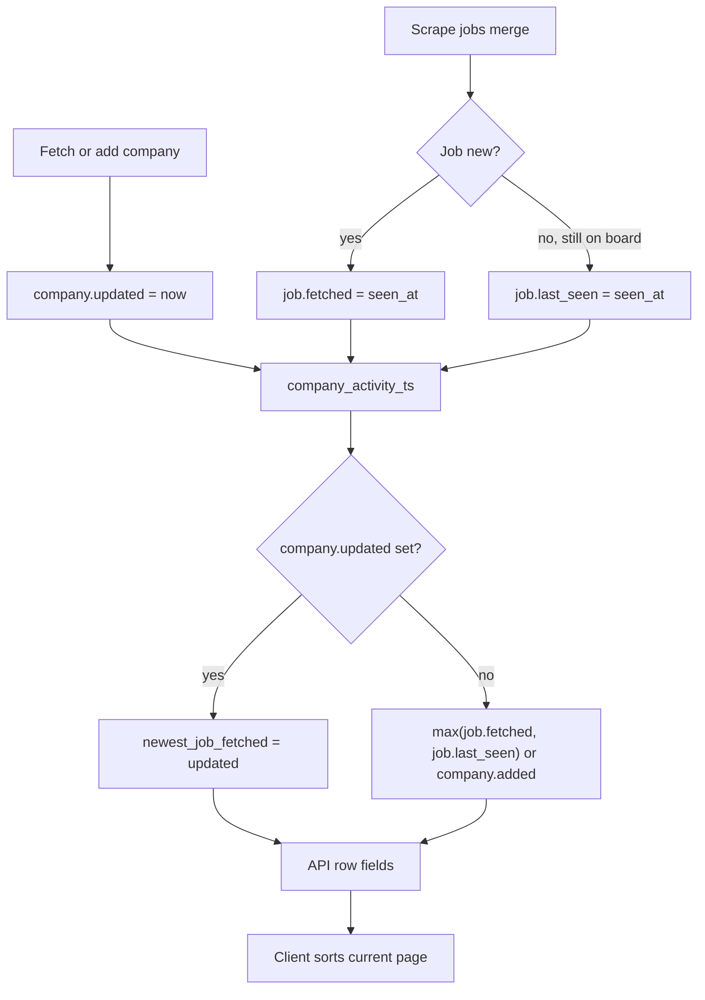

# Panel board — pagination, sort, and activity timestamps

**Last updated:** 2026-06-26

How the main company board loads, paginates, and sorts by “newest”. Read before changing `panel/`, `static/js/board*.js`, `static/js/render.js`, or `GET /api/board`.

Related: [business-rules.md](business-rules.md) (job buckets), [architecture.md](architecture.md) (panel read path).

---

## Board load path

```
GET /api/board
  → panel/board.load_catalog_board_page()
  → panel/service.flatten_companies_page()
      → catalog/repo.load_catalog_companies_page()   # DB batch, ORDER BY country, name
      → panel/flatten.flatten_company()              # per-user merge + filters
  → web/routes/board.py                              # meta + user_stats
```

Client:

```
board.js (fetch page)
  → board-view.js syncBoardView()
  → render.js getDisplayCompanies()
      → applyPanelFilters()
      → sortCompaniesList()                          # client sort (see below)
  → React company cards (frontend/)
```

Toolbar layout: **pagination → search → sort/filters → company cards**.

---

## “Newest first” sort

Default sort is **Newest first** (`index.html` `#sortSelect`, mirrored by hidden `#sortNewestFetch`). Preference persists in `localStorage` (`panel_sort_newest`).

| Layer | Behavior |
|-------|----------|
| **Server** | When `sort=newest` (default), flattens all filter-visible companies, sorts by activity timestamp, then paginates. |
| **Client** | Sends `sort=newest|name` on `GET /api/board`; re-sorts the current page only as a fallback during local fetch UX. |

Sort key (client): `newest_job_fetched` → `latest_fetched` → `updated` (`render.js` `companyActivityTs`).

During an active per-company fetch:

- Order is **frozen** (`freezeCompanyOrder`) so cards do not reshuffle as timestamps update.
- The company being fetched is pinned to the top with an optimistic `updated` / `newest_job_fetched` (`touchFetchingCompanyTimestamp`).

Alternative sort: **Company A–Z** (country label, then name).

### Pagination note

`sort=newest` scans and flattens the full visible catalog for the current scope/filters on each page request, then sorts before slicing. This is correct but heavier than `sort=name` (streaming catalog order). Cursor-based pagination remains a future optimization.

---

## Activity timestamp flow

What “newest” means for a company:



### `company_activity_ts` (server)

`shared/timestamps.py` — used when flattening each company row:

1. **`company.updated`** — if set, wins (highest priority).
2. Else **max** of all stored jobs’ `job_activity_ts` (`fetched` or `last_seen`).
3. Else **`company.added`** (date company entered catalog).

### Job timestamps (scrape merge)

`scrape/merge.py` on each fetch:

| Field | Meaning |
|-------|---------|
| `fetched` | First time this job was discovered |
| `last_seen` | Last scrape that still saw the job on the ATS |

- **New job:** both set to `seen_at`.
- **Existing job seen again:** `fetched` preserved; `last_seen` updated to `seen_at`.
- **Stale job** (not on ATS this run): kept in catalog; timestamps unchanged.

### API row fields

`panel/flatten.py` `_build_company_row`:

| Field | Source |
|-------|--------|
| `newest_job_fetched` | `company_activity_ts(company, stored_jobs)` |
| `latest_fetched` | Max `job_activity_ts` over **visible** jobs after filters, else `newest_job_fetched` |
| `updated` | Raw `company.updated` from catalog |

After a country or per-company fetch, companies usually rise in sort order because **`company.updated` is bumped**, not because every job’s `fetched` changed.

### When timestamps are written

| Event | What gets set |
|-------|----------------|
| Add company (panel) | `added`, `updated` = today |
| Per-company / country fetch completes | `company.updated` = ISO now |
| Country fetch finishes | `country_meta.last_fetch_new_jobs` = count of new jobs |
| Scrape merge | per-job `fetched` / `last_seen` |

`last_fetch_new_jobs` / `meta.latest_fetch_new_jobs` is a **stats counter** (“new jobs in last country fetch”). It is **not** used for company sort order.

---

## Pagination (visible offset)

`flatten_companies_page` scans the scoped catalog in DB order, applies flatten + panel filters, counts **visible** companies, skips `visible_offset`, returns up to `limit` rows.

- Filters and search affect which companies count toward pages.
- `meta.total_companies` / `total_pages` reflect visible count (computed on page 1).
- Catalog SQL order: `catalog/repo.py` → `ORDER BY c.country, c.name`.

---

## Key files

| Area | File |
|------|------|
| API | `web/routes/board.py` |
| Pagination + flatten | `panel/service.py`, `panel/flatten.py` |
| Timestamps | `shared/timestamps.py` |
| Scrape merge | `scrape/merge.py` |
| Client load | `static/js/board.js` |
| Client sort | `static/js/render.js` |
| Sort UI | `static/js/filters.js`, `static/js/storage.js` |
