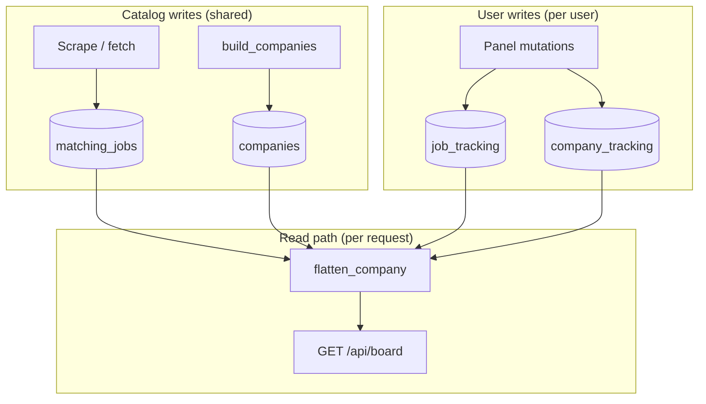

# Catalog + per-user overlay

**Last updated:** 2026-06-28

How this panel separates **shared job data** from **per-user state** — a common pattern in job boards, CRMs, and any product where many users see the same reference records but act on them independently.

Related: [architecture.md](architecture.md) (package layout), [schemas.md](schemas.md) (catalog shapes), [business-rules.md](business-rules.md) (job buckets), [board.md](board.md) (read path).

---

## The problem

You scrape ATS boards and store thousands of roles. Many users use the same panel. They often look at **the same companies and URLs**, but each user has their own answers to:

- Did I apply?
- Did I reject it?
- Is it not for me?
- Did I see it before?
- Which role do I want pinned on my board?

If you store `user_id` on catalog jobs, you duplicate every position for every user. Updates from scrape (new title, closed role, `fetched` date) become a nightmare: which copy is canonical?

If you store only global jobs with no per-user layer, everyone shares one “applied” flag — useless for a multi-user panel.

You need **two layers**.

---

## The pattern: reference catalog + user overlay

This is a well-known shape. You may see it described as:

| Name | Idea |
|------|------|
| **Reference data + transactional overlay** | Master list is shared; user actions attach in a separate store |
| **Product catalog + customer cart** (analogy) | Same SKU, different line items per shopper |
| **CQRS-lite** | One write model for catalog (scrape), another for user mutations (tracking); read path merges them |
| **Overlay / projection** | API response is built at read time, not stored as one wide table |

**Rule of thumb:** anything that comes from **scrape or admin catalog edits** lives in the **catalog**. Anything that comes from **a user clicking in the panel** lives in **tracking**, keyed by `user_id`.



No user id on `matching_jobs`. User id on every `job_tracking` row.

---

## What lives where

### Catalog (shared)

Postgres tables `companies`, `matching_jobs`, `country_meta`. One row per company per country; one row per open role in the catalog.

Typical fields:

- Company: name, city, careers URL, ATS type, fetch status, `updated`
- Job: title, URL, `idempotency_key`, `fetched`, `last_seen`, visa flag, location tags

**Sources:** `build_companies.py`, country/company fetch (`scrape/` → `catalog/repo.sync_company_board_to_catalog`), manual company CRUD.

**Not in catalog:** applied, rejected, seen, pin, not-for-me — those are user opinions about a shared role.

### User overlay (per user)

Postgres tables `job_tracking`, `company_tracking`, `job_status_events`, `fetch_runs`.

Primary key for job state:

```text
(user_id, country, company_name, job_url)
```

Same Scout24 URL for user 1 and user 42 → **two rows** only after each user interacts (or when you upsert on first mutation). The catalog still has **one** `matching_jobs` row.

Company-level flags (e.g. awaiting response, board pin) use:

```text
(user_id, country, company_name)
```

### Read model (merged at request time)

`panel/flatten.flatten_company()`:

1. Load catalog companies + `matching_jobs` for the selected country
2. Load `job_tracking` / `company_tracking` for the logged-in user (scoped to country when possible)
3. For each stored job, build a **view** via `panel/tracking.job_dict()` — catalog fields + overlay fields
4. **Partition** into exactly one bucket: `jobs`, `rejected_jobs`, or `not_for_me_jobs` ([business-rules.md](business-rules.md))
5. Reinject **orphans** (tracked jobs that disappeared from ATS) so users do not lose history
6. Apply filters, sort, paginate

The JSON the client sees is already merged. React never talks to “raw catalog” vs “raw tracking” separately on the main board.

---

## Many users, same positions

This is the normal case, not an edge case.

| User A | User B | Catalog |
|--------|--------|---------|
| Pins “Backend Engineer” at FlixBus | Pins “Data Engineer” at FlixBus | One FlixBus company row; two jobs |
| Applied to role X | Never opened role X | One `matching_jobs` row for X; optional `job_tracking` rows per user |

Conflicts are avoided by **composite keys that include `user_id`**. You never ask “who owns this job row in the catalog?” — nobody does. You ask “what did this user do with this URL?”

Identity matching uses normalized URL and `idempotency_key` (`core/job_identity.py`, `panel/tracking.resolve_track`) so minor URL variants still attach to the right tracking row.

---

## Pin fits the overlay, not the catalog

Pinning is **UI preference + workflow**, not a property of the job on the ATS.

Current implementation (2026-06):

| Concern | Table | Field |
|---------|--------|--------|
| Pin this role to top of its company card | `job_tracking` | `pinned`, `pinned_at` |

Rules today:

- One **pinned job** per user per **company** (pinning a new role in the same company clears the previous pin there)
- Pinning a job does **not** move the company on the board; company order stays on newest activity (`job.fetched`)

API: `POST /api/jobs/pin`. Server sorts pinned jobs first within each company card on `GET /api/board`.

### If requirements grow

Stay on the overlay model; change the **shape** of pin storage:

| Need | Direction |
|------|-----------|
| Multiple pinned jobs per company with order | `user_job_pins(user_id, country, company_name, job_url, sort_order)` |
| Ordered list without many rows | `company_tracking.pinned_jobs JSONB` |
| Pin without other tracking fields | Insert pin row only; still keyed by user + job identity |

**Avoid:** a middle table with only `(user_id, company)` and no job identity — you cannot represent “which roles are pinned” or in what order.

**Avoid:** adding `user_id` to `matching_jobs` — you fork the catalog every time someone pins or applies.

---

## Why Postgres (and not “just use Mongo”)

The team moved from Neon to **AWS Postgres on EC2** for cost and control, not because SQL cannot handle evolving features.

| Concern | Postgres approach here |
|---------|-------------------------|
| Schema changes | `ADD COLUMN IF NOT EXISTS` migrations at startup (`core/migrations.py`) |
| Shared + per-user | Relational PKs `(user_id, …)` are a natural fit |
| Board queries | Country-scoped catalog pages, counts, admin stats — SQL already powers these |
| Pin added later | New columns on existing overlay tables; catalog untouched |

MongoDB (or any document store) does **not** remove schema evolution — document shapes still change; you write migration scripts against documents instead of `ALTER TABLE`. This codebase already has ~100+ tests and SQL-only-in-`repo.py` rules ([rules.md](rules.md)). A second database on EC2 adds ops surface (backup, auth, monitoring) without removing flatten/merge logic.

JSONB on Postgres is the pragmatic escape hatch if pin (or similar prefs) need flexible nested structures **without** leaving the overlay model.

---

## End-to-end flow (this repo)

```text
relocate.me
    ↓
build_companies.py          → companies (catalog)
    ↓
fetch / scrape_jobs.py      → matching_jobs (catalog)
    ↓
GET /api/board
    load catalog page
    load job_tracking + company_tracking for g.user_id
    flatten_company()       → merged companies[] with job buckets
    ↓
Panel UI                    → mutations POST /api/jobs/*
    ↓
positions/service           → upsert job_tracking / company_tracking
    ↓
job-board.js                → patch local board (optional pin via /api/jobs/pin)
```

Catalog writes are **batch** (scrape, build). User writes are **small** (single job/company mutations). Reads are **merge-heavy** — by design.

---

## Invariants (do not break)

1. **Catalog rows are user-agnostic.** Scrape updates one truth for a URL.
2. **Tracking rows are user-scoped.** Keys always include `user_id`.
3. **One bucket per job per user** on the board (open / rejected / not-for-me) — see [business-rules.md](business-rules.md).
4. **Merge at read time** in `panel/`, not in the client alone — API must match rules for pagination and stats.
5. **Job identity** — prefer `idempotency_key` + normalized URL when matching tracking to catalog jobs.

---

## Code map

| Concern | Location |
|---------|----------|
| Catalog CRUD / sync | `catalog/repo.py` |
| Scrape → catalog | `scrape/merge.py`, `scrape/enrich.py` |
| Load tracking | `users/repo.py` (`load_job_tracking`, `load_company_tracking`) |
| Merge + partition | `panel/flatten.py`, `panel/tracking.py` |
| User mutations | `positions/service.py`, `positions/repo.py` |
| Board API | `panel/board.py`, `web/routes/board.py` |
| Pin | `positions/repo.set_job_pinned`, `POST /api/jobs/pin` |

---

## Further reading in this repo

- [schemas.md](schemas.md) — `CountryCatalog`, `MatchingJob`, `JobStatusUpdate`
- [catalog-seed-test-failure.md](catalog-seed-test-failure.md) — why tests must reset catalog, not assume an empty DB
- [board.md](board.md) — sort and pagination on top of flattened catalog rows
- [board-read-model-proposal.md](board-read-model-proposal.md) — proposal to persist per-user board projection for fast reads (not implemented)

When adding a feature, ask: **“Is this a fact about the job on the internet, or a fact about what this user did?”** The first goes to catalog; the second to tracking.
