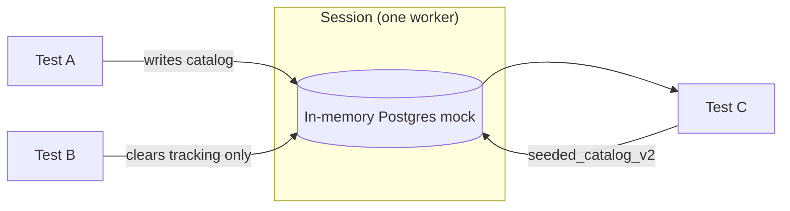

# When board sort tests broke the jobs API tests

**Last updated:** 2026-06-28

A post-mortem on a real pytest failure: four unrelated tests started failing after we added “newest first” board sort coverage. Production code was fine. The catalog in the test database was not reset the way we assumed.

Related: [board.md](board.md) (sort behavior), [contributing.md](../contributing.md) (how to run tests), [rules.md](rules.md) (test helpers).

---

## What we saw

Running the v2 suite:

```bash
pytest tests -o addopts=
```

Four failures, all counting companies or jobs in the UK catalog:

| Test | Assertion | Actual |
|------|-----------|--------|
| `test_jobs_list_returns_companies` | `len(companies) == 1` | 2 |
| `test_country_fetch_runner` | `done == 1` | 2 |
| `test_admin_panel_stats` | `total_jobs == 2` | 3 |
| `test_admin_panel_stats_open_roles_exclude_applied_and_not_for_me` | open roles after hide | wrong company targeted |

The extra company was always **AAA Older Fetch** — a name that only exists in board sort tests, not in the UK minimal fixture.

---

## Why it was confusing

We had just shipped a large change set: newest sort on the server, not-for-me excluded from sort keys, enrich no longer stomping `fetched`, client order fixes, stats tweaks. It was natural to suspect a regression in panel or flatten logic.

But the API responses were internally consistent with **two companies in Postgres**, not with a sort bug:

- `/api/jobs?country=uk` returned Acme Backend Ltd **and** AAA Older Fetch.
- Country fetch `done == 2` meant the runner saw two companies — exactly what the catalog contained.

The failures were **order-dependent**: pass in isolation, fail after `test_board_api.py` ran in the same worker.

---

## How the test database actually works



1. **`_session_postgres`** — one in-memory DB per pytest-xdist worker for the whole session.
2. **`db` fixture (per test)** — calls `clear_tracking()`: wipes `job_tracking`, `fetch_runs`, extra users, etc. **Does not delete `companies` or `matching_jobs`.**
3. **`seeded_catalog_v2`** — runs before each test that asks for it; should put UK back to a known state.

That design is intentional: resetting only tracking is fast; catalog rows are meant to be stable unless a test or seed step changes them.

---

## What the board tests did

Newest-sort tests in `tests/web/test_board_api.py` need two companies with different `job.fetched` timestamps. They call `sync_company_board_to_catalog` to add **AAA Older Fetch** and to add or mutate jobs on **Acme Backend Ltd**.

That is correct for those tests. `sync_company_board_to_catalog` is an upsert: it writes one company row and its jobs. It does **not** remove other companies in the country.

So after the board tests, the UK catalog looked like:

| Company | Source |
|---------|--------|
| Acme Backend Ltd | fixture + mutations from sort / not-for-me tests |
| AAA Older Fetch | inserted only for sort tests |

Any later test that still assumed “UK = one company from `country_uk_minimal.json`” was wrong — not because the fixture changed, but because the **database** still held the extra company.

---

## What `seed_country` did wrong

Before the fix, `tests/helpers/seed.py` did this:

1. Upsert `country_meta` from the fixture.
2. For each company **in the fixture**, call `sync_company_board_to_catalog`.

Step 2 refreshed Acme (and would create missing fixture companies) but **never deleted** AAA Older Fetch. Seeding was **additive**, not a full sync.

`sync_country_catalog` in `catalog/repo.py` already had the right semantics for production imports:

- Upsert every company in the payload.
- **`DELETE FROM companies WHERE country = ? AND name NOT IN (fixture names)`**

The test helper simply was not using it.

---

## The fix

`seed_country()` now:

1. Deep-copies the fixture (so tests cannot mutate the on-disk JSON).
2. Stamps job identity fields on jobs.
3. Calls **`sync_country_catalog(country_key, data)`** — full sync, including removal of stray companies.

Every test that depends on `seeded_catalog_v2` gets the same UK catalog: one company, two jobs, as in `tests/fixtures/country_uk_minimal.json`.

```bash
pytest tests -o addopts=   # 131 passed
pytest tests               # 131 passed with -n auto
```

---

## Lessons

**Upsert ≠ reset.** If a helper “seeds” data, be explicit whether it means “ensure these rows exist” or “this country must match this file exactly.” Tests usually need the second.

**Pollution is silent.** Extra rows rarely throw until someone asserts `len(companies) == 1`. Prefer helpers that match the assertion’s assumptions.

**Name tests after isolation needs.** Board tests that add companies are fine; they rely on the next test’s seed being a true reset. Document that contract (this article).

**When adding catalog data in a test:**

- Use `seeded_catalog_v2` / `sync_country_catalog` so the next test starts clean, or
- Delete your rows in teardown, or
- Mark the test with `@pytest.mark.fresh_db` if you need a full wipe (slower).

Do not assume `sync_company_board_to_catalog` alone leaves a clean country for the next test.

---

## Files touched

| File | Role |
|------|------|
| `tests/helpers/seed.py` | Fix: `sync_country_catalog` |
| `tests/web/test_board_api.py` | Tests that added AAA Older Fetch |
| `tests/fixtures/country_uk_minimal.json` | Canonical UK seed |
| `relocation_jobs/catalog/repo.py` | `sync_country_catalog` delete-absent logic |
| `tests/conftest.py` | `db` / `seeded_catalog_v2` fixtures |
| `tests/helpers/postgres_mock.py` | `clear_tracking` vs `clear_data` |
