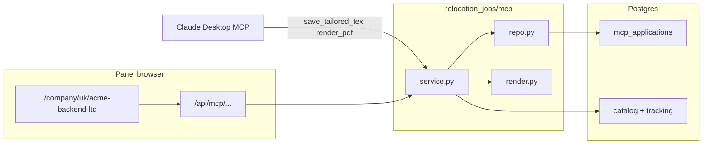

# Company workspace (panel)

**Last updated:** 2026-07-02

Panel UI for viewing per-position tailored resumes and PDF previews after Claude Desktop MCP has prepared application artifacts. Complements [mcp-application.md](mcp-application.md) (MCP tools + `/apply` setup).

---

## Problem

The MCP pipeline stores tailored LaTeX and PDF bytes in `mcp_applications`, but the main job board only shows tracking state (`applied`, `looking_to_apply`, `pinned`). Users cannot see which positions have a tailored CV or preview the PDF without leaving the panel.

---

## Goals by phase

| Phase | Status | Deliverable |
|-------|--------|-------------|
| **1 — API** | Done | Web routes to list company positions with MCP state; serve tex/PDF; re-render PDF |
| **2 — Workspace page** | Done | `/company/<country>/<company-slug>` — position list + LaTeX source + PDF preview |
| **3 — Board integration** | Done | CV/PDF badges on position cards; company name links to workspace |
| **4 — Edit loop** | Later | Editable tex in panel, debounced re-render, validation errors in UI |
| **5 — Job descriptions** | Later | Scrape/store JD text; show on workspace; apply opens ATS URL |

Out of scope for early phases: browser auto-submit, headless Claude API, full Overleaf-style live editor.

---

## URL scheme

| Path | Purpose |
|------|---------|
| `/company/<country>/<company-slug>` | Company workspace page (static shell + JS) |
| `/api/mcp/companies/<country>/<company>/applications` | All catalog positions merged with MCP + tracking state |
| `/api/mcp/applications/<idempotency_key>` | Single position application detail |
| `/api/mcp/applications/<idempotency_key>/tex` | Tailored resume LaTeX source |
| `/api/mcp/applications/<idempotency_key>/pdf` | Stored resume PDF (`application/pdf`) |
| `/api/mcp/applications/<idempotency_key>/render` | Re-compile resume tex → update PDF in DB |
| `/api/mcp/applications/<idempotency_key>/cover-letter/tex` | Cover letter LaTeX source |
| `/api/mcp/applications/<idempotency_key>/cover-letter/pdf` | Stored cover letter PDF |
| `/api/mcp/applications/<idempotency_key>/cover-letter/render` | Re-compile cover letter tex → update PDF |

**Company slug:** lowercase, non-alphanumeric runs become `-` (same rules as master resume slugs). Resolved to catalog `companies.name` within the country. Example: `Acme Backend Ltd` → `acme-backend-ltd` → `/company/uk/acme-backend-ltd`.

Canonical DB keys remain `(country, company_name, idempotency_key)` — the slug is only for readable URLs.

---

## Workspace page layout

```text
┌─────────────────────────────────────────────────────────────┐
│  Acme Corp · UK                    [Job panel] [Sign out]   │
├─────────────────────────────────────────────────────────────┤
│  Positions (left)              │  Selected position (right) │
│  ○ Senior Go Engineer PDF CL   │  Title · location          │
│  ○ Staff Backend          CV   │  [CV | Cover letter] tabs  │
│  ● Platform Engineer      PDF  │  ┌──────────┬────────────┐ │
│                                │  │ LaTeX    │ PDF preview │ │
│                                │  └──────────┴────────────┘ │
│                                │  [Re-render PDF] [Download]│
└─────────────────────────────────────────────────────────────┘
```

Switch **CV** vs **Cover letter** to edit/preview the matching artifact. PDF preview uses stored `pdf_bytes` or `cover_letter_pdf_bytes` from Postgres. **Re-render** calls the same server compile path as MCP (`tectonic` / `MCP_LATEX_CMD`). Cover letters skip master-structure validation.

---

## Data flow



---

## API response shapes (phase 1)

### `GET .../companies/<country>/<company>/applications`

```json
{
  "country": "uk",
  "company": "Acme Backend Ltd",
  "company_slug": "acme-backend-ltd",
  "positions": [
    {
      "title": "Senior Go Engineer",
      "url": "https://…",
      "idempotency_key": "…",
      "location": "London",
      "applied": false,
      "looking_to_apply": true,
      "pinned": false,
      "has_tailored_tex": true,
      "has_pdf": true,
      "master_resume_slug": "go",
      "tailored_tex_updated_at": "…",
      "pdf_updated_at": "…"
    }
  ]
}
```

Positions come from catalog `matching_jobs`, overlaid with per-user tracking and `mcp_applications` rows (if any).

### `GET .../applications/<idempotency_key>/tex`

```json
{
  "idempotency_key": "…",
  "content": "\\documentclass{article}…",
  "master_resume_slug": "go",
  "updated_at": "…"
}
```

---

## Board integration (phase 3)

- Position cards show badges when `has_tailored_tex` / `has_pdf` (from board API join or lazy fetch).
- Company name on the board links to `/company/<country>/<slug>`.
- Main board stays a triage list; deep application prep lives on the workspace page.

---

## Future: job descriptions

1. Add `description_text` (or side table) on catalog jobs — scrape on company fetch or on demand.
2. Show JD on the workspace right pane above the CV preview.
3. **Apply** opens the ATS URL in a new tab; panel records `mark_applied` when the user returns.

See [mcp-application.md](mcp-application.md) out-of-scope table for v0 MCP boundaries.

---

## Tests

```bash
pytest tests/mcp tests/web/test_mcp_company_workspace.py -o addopts=
```

---

## Related

- [mcp-application.md](mcp-application.md) — MCP tools, `/apply`, Claude Desktop flow
- [board.md](board.md) — main job panel API and pagination
- [architecture.md](architecture.md) — package layout
