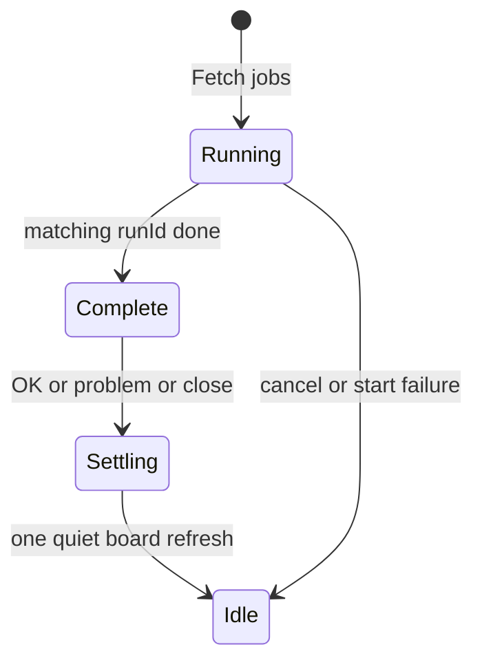

# Fetch panel session: why single-company fetch felt flaky

**Last updated:** 2026-07-13  
**Status:** fixed (client session model + settle-after-decision UX)

Single-company “Fetch jobs” looked unreliable: a prior run’s completion UI flashed when starting a new fetch, the board refreshed twice (once on complete, again on OK/problem), and card entrance animations replayed on every republish. The cause was not a broken scrape — it was **missing session ownership** on the client, plus a UX that reloaded the board while the decision modal was still open.

Related: [architecture.md](architecture.md), [full-spa-ui-modernization-proposal.md](full-spa-ui-modernization-proposal.md), UX skills under [`.claude/ux-skills/`](../../.claude/ux-skills/)

---

## Executive summary

| | |
|---|---|
| **Symptom** | Stale “Fetch complete” / review list flash; board jumps twice; cards fade-in on every badge update. |
| **User impact** | Hard to trust Yes/No feedback; feels like the panel is fighting itself. |
| **Root cause** | Sticky server status + `setInterval` poll races + `loadJobs` on complete *and* on feedback; no client `runId`/phase gate; `.company-card { animation: fadeInUp }` on every remount. |
| **Outcome** | One fetch session owns the modal until the user decides; board settles **once**; entrance motion only on real board navigations. |

---

## What was wrong (precisely)

### 1. Sticky status without session ownership

The server correctly keeps the **last completed** fetch payload (including `review_jobs`) so the panel can reopen after refresh. That is intentional.

The client treated every `/api/fetch/status` payload as “paint this now.” When a new company fetch started:

1. Modal opened in a “starting” state.
2. First poll(s) could still return the **previous** completed run (or race with an unbound `run_id`).
3. `applyFetchStatus` painted review / LAST RUN from that sticky payload.
4. Moments later the new run bound — UI jumped again.

Patches that only cleared `lastFetchReview` or skipped one `syncFetchStateFromServer` call were fragile: any reconciler path (`resume`, `openFetchProgress`, visibility tick) could re-apply sticky complete into an in-flight start.

### 2. Two board updates for one decision

On fetch complete the poller called `loadJobs`. When the user clicked Yes/No, feedback handlers patched badges and/or reloaded again. Under the open modal that felt like:

- Board reshuffles while Yes/No is still the focus.
- Then a second paint after the decision.

That violates a simple contract: **the modal owns the interaction until the user finishes it; the board catches up once.**

### 3. High-frequency entrance animation

`.company-card { animation: fadeInUp … }` ran on every React republish (`syncBoardView`, fetch busy toggle, quiet reload). Entrance motion is fine for page load / pagination; it is noise for badge patches and settle refreshes (see Emil frequency table + `review-animations` STANDARDS).

---

## Design contract (why this UX)

Justified from `.claude/ux-skills/` (Emil design engineering + Apple response/interruptibility + animation STANDARDS):

| Phase | Modal | Board | Motion |
|-------|--------|--------|--------|
| **Running** | Title + short status + Cancel | Still (optional fetching highlight) | Activity pulse only; Cancel always works |
| **Complete** | Summary line + review evidence + Yes/No | Still — **no** `loadJobs` | No LAST RUN 4-cell grid for single-company |
| **Settling** | Footer already shows OK/problem, or panel closes | **One** quiet `loadJobs({ preserveContent, noOverlay, enterAnimation: false })` | No card entrance storm |
| **Idle** | Closed / reopen via explicit chip only | Normal | Entrance only under `#jobs.board-enter` |

**Why settle after decision, not on complete:**  
If the board reloads while Yes/No is open, motion is not feedback for the decision — it competes with it. Instant footer + optimistic badge is Apple “response”; one quiet settle afterward is the catch-up.

**Complete subtitle replaces LAST RUN for single-company:**  
e.g. `6 matched · 51 filtered · 0 new · 5s` — one job per moment, less clutter.

---

## Technical approach

### Client fetch session

```js
fetchSession: {
  phase: "idle" | "starting" | "running" | "complete" | "settling",
  runId: null,
  kind: "company" | "country" | null,
  country: null,
  company: null,
  boardDirty: false,
}
```

Helpers live in `relocation_jobs/static/js/state.js`:

| Helper | Role |
|--------|------|
| `beginCompanySession` | Wipe ownership; phase `starting` |
| `bindSessionRun(runId)` | Phase `running`; poll only accepts this id |
| `completeSession` | Phase `complete`; `boardDirty = true`; **no** board reload |
| `endSession` / `endSessionAndSettle` | One quiet board refresh if dirty → `idle` |



### Session-gated paint

`applyFetchStatus` in `scrape.js`:

- **Running + single-company:** progress / activity only. Never `renderFetchReview`. Hide completion meta grid.
- **Complete + single-company:** summary subtitle + review + Yes/No; `hideCompletionMeta: true`.
- Poll / reconciler ignore status that does not belong to `session.runId` while starting/running.

`syncFetchStateFromServer`, `openFetchProgress`, and `resumeFetchIfRunning` reconcile **flags** during an active session — they must not paint sticky complete into `starting`/`running`.

### Serial poll

Replaced `setInterval` with chained `setTimeout` + `fetchPollInFlight` so overlapping ticks cannot apply two statuses out of order. Visibility changes trigger a single tick, not a pile-up.

### Close vs settle

| Action | While running | After complete |
|--------|----------------|----------------|
| Close / Escape | Hide panel only; keep chip + polling | `endSessionAndSettle` (one quiet reload if dirty) |
| Yes / No | — | Optimistic footer + badge, then settle |
| Cancel | Interrupt fetch (server cancel); keep interruptible | — |

### Board entrance gate

```css
/* Only when loadBoard opts into entrance (page / filter navigations) */
#jobs.board-enter .company-card {
  animation: fadeInUp 0.25s ease both;
}
```

`loadBoard({ enterAnimation })` / `applyBoardView({ enterAnimation })` set `#jobs.board-enter` briefly. Quiet settle passes `enterAnimation: false`.

Yes/No buttons: `:active { transform: scale(0.97) }` (~160ms ease-out) so the decision feels pressed immediately.

### Server side (unchanged contract, asserted)

`reset_for_run` already clears `review_jobs` to `None` for the new run. Sticky last-completed remains for reopen when the client is **idle**. Test coverage:

`tests/fetch/test_fetch_state_stale.py::test_reset_for_run_clears_previous_review_jobs`

---

## Key files

| File | Change |
|------|--------|
| `static/js/state.js` | `fetchSession` + begin/bind/complete/end helpers |
| `static/js/scrape.js` | Session-gated paint, serial poll, `endSessionAndSettle` |
| `static/js/fetch-render.js` | `hideCompletionMeta` on single-company complete |
| `static/js/fetch-actions.js` | Optimistic Yes/No; settle-once; close-while-running ≠ abort |
| `static/js/board.js` | `enterAnimation` / `#jobs.board-enter` |
| `static/js/events.js` | Escape matches close semantics |
| `static/styles.css` | Gated `fadeInUp`; button press feedback |
| `static/index.html` | Cache bump (`styles.css`, `main.js`) |

Country fetch keeps a quiet board reload on complete (no Yes/No decision loop). Visual redesign of country fetch is out of scope; regressions avoided via the same poll/session guards.

---

## Verification checklist

1. Start single-company fetch → until complete: no review list, no LAST RUN grid, no board wipe.
2. Complete → summary + review + Yes/No once; board still underneath.
3. Yes → footer confirms immediately; **one** quiet settle; cards do not replay entrance.
4. Start another fetch immediately → clean Running phase (no prior completion flash).
5. Close during Running → panel hides; header chip + poll continue; Cancel still available when reopened.

```bash
pytest tests/fetch/test_fetch_state_stale.py tests/web/test_fetch_api.py -o addopts=
```

Hard-refresh the panel after static version bumps so the browser does not keep old `scrape.js`.

---

## Why this is the precise fix (not more patches)

| Approach | Why it fails or falls short |
|----------|-----------------------------|
| Clear `lastFetchReview` on open only | Reconciler / sticky status can repaint mid-start |
| `expectedRunId` on poll only | Incomplete without phase gate + serial ticks + settle policy |
| Reload board on complete “so data is fresh” | Competes with Yes/No; causes the double-update feel |
| Keep `fadeInUp` on all cards | Every `syncBoardView` looks like a full page reload |

The invariant is small and enforceable:

> **Only status for `session.runId` may paint the modal. The board reloads at most once per session, after the user ends the modal conversation.**

That is what made the UI stop feeling flaky.
