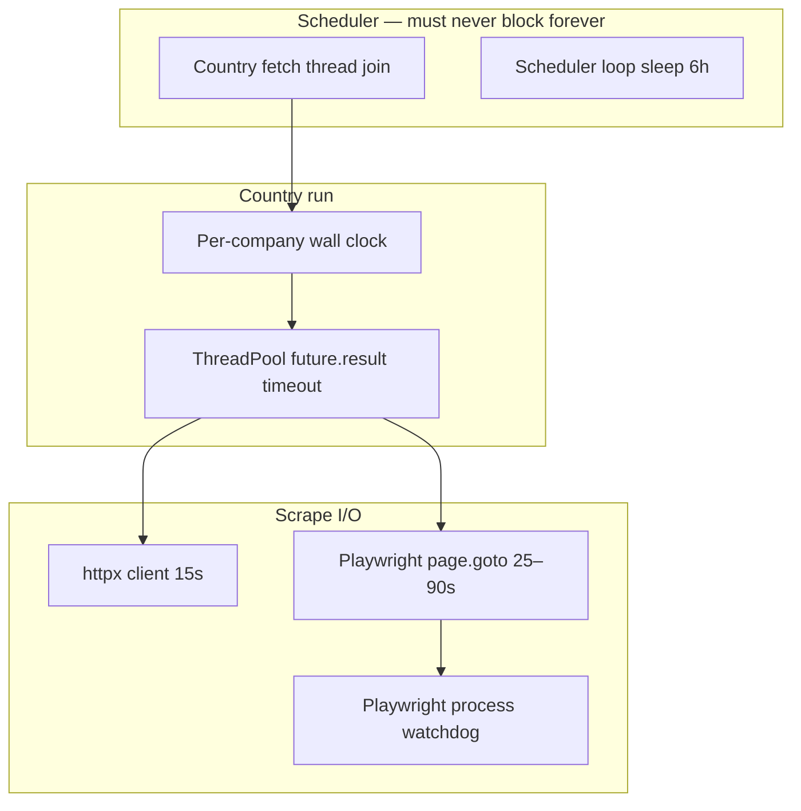

# Fetch scheduler: timeout and hang resilience

**Last updated:** 2026-07-10  
**Status:** implemented (2026-07-10)  
**Trigger:** EC2 worker blocked 15+ hours on a hung Playwright scrape (endios, Germany run 341)

Related: [operations/ec2-panel.md](../operations/ec2-panel.md), [kafka-fetch-pipeline-proposal.md](kafka-fetch-pipeline-proposal.md), [board-load-performance-incident.md](board-load-performance-incident.md)

---

## Executive summary

| | |
|---|---|
| **Symptom** | Scheduled country fetches stopped for 15+ hours; worker container still “Up”. |
| **Root cause** | Playwright hung on **endios** generic board (`https://www.endios.de/en/karriere/`). Scheduler blocked on `wait_for_fetch_thread()` with **no timeout**. |
| **Amplifier** | Panel process called `reap_orphan_running_fetch_runs()` while worker thread was still alive — DB marked run `failed`, worker kept waiting forever. |
| **Principle** | **Nothing in the fetch path may block without a bounded timeout.** Timeouts are not optional for this project. |

---

## Incident timeline (2026-07-10)

```text
00:11:53  Germany fetch started (run 341, 98 companies, concurrency 4)
00:11:58  endios generic scrape started — never returned
00:13:37  Last log (97/98 companies done; endios still in flight)
00:36:13  Postgres run marked failed: "Fetch interrupted (server restarted)"
          (misleading — no restart; panel reap while worker thread hung)
15:50:30  Manual `docker restart relocation-fetch-worker` — scheduler resumed
```

Playwright/Chromium child processes from 00:12 were still running until restart.

---

## Design rule: layered timeouts

Every blocking boundary gets a **hard ceiling**. Inner layers must be **strictly shorter** than outer layers.



### Recommended ceilings

| Layer | Where | Current | Target | Notes |
|-------|--------|---------|--------|-------|
| HTTP client | `fetch/client.py` | 15s | 15s | OK |
| Generic HTTP board | `scrape/boards/generic.py` | 15s | 15s | OK |
| Playwright `goto` | `scrape/playwright_board.py` | 25s | 60s max | `networkidle` boards use 90s elsewhere — cap all |
| Playwright **process** | `run_sync` / fallback | **none** | **90s** | `goto` timeout does not kill a stuck renderer |
| Per-company fetch | `country_runner._fetch_one_thread` | **none** | **5 min** | One bad company must not block 97 others |
| Country fetch thread | `scheduler.wait_for_fetch_thread` | **none** | **45 min** | Germany ~98 cos × ~2 min worst case + headroom |
| Scheduler cycle | `run_scheduler_loop` | 6h sleep only | unchanged | Sleep runs only **after** country join returns |

Env knobs (proposed):

```bash
FETCH_COMPANY_TIMEOUT_SECONDS=300      # per company
FETCH_COUNTRY_TIMEOUT_SECONDS=2700       # per country (scheduler join)
PLAYWRIGHT_BOARD_TIMEOUT_SECONDS=90      # wall clock for entire sync fallback
```

---

## Code changes (implementation plan)

### Phase 1 — unblock the scheduler (highest priority)

1. **`wait_for_fetch_thread(timeout=...)` in scheduler**  
   `relocation_jobs/fetch/scheduler.py`: pass `FETCH_COUNTRY_TIMEOUT_SECONDS` (default 2700).  
   On timeout: log error, call `request_fetch_cancel()`, set in-memory state failed, `persist_fetch_run()`, continue to next country / sleep.

2. **Per-company timeout in `country_runner`**  
   Wrap `_fetch_one_thread` / `asyncio.wait_for(_inner(), timeout=...)` or `future.result(timeout=...)` on `ThreadPoolExecutor` submits.  
   On timeout: log `[n/total] Company — timed out after Ns`, mark `fetch_problem` on company row (optional but useful), continue pool.

3. **Playwright watchdog**  
   Run `scrape_board_with_playwright` inside `concurrent.futures` with `result(timeout=PLAYWRIGHT_BOARD_TIMEOUT_SECONDS)` or a dedicated helper in `scrape/boards/_async.py` (`run_sync_timed`).  
   On timeout: kill browser subprocess if possible; return `[]` and log warning (same as other scrape errors).

### Phase 2 — fix cross-process reap

Panel (`PANEL_SCRAPE_ENABLED=0`) and worker are **separate processes** sharing `fetch_runs`.

| Problem | Fix |
|---------|-----|
| Panel `bootstrap_app()` / `reap_zombie_fetch()` marks worker runs `failed` while worker thread lives | Panel must **not** call `reap_orphan_running_fetch_runs()` when it is not the fetch owner |
| Misleading message `Fetch interrupted (server restarted)` | Use `Fetch interrupted (orphan reap)` or reap only from worker bootstrap |

Concrete approach:

- Add `fetch_repo.list_running_fetch_runs()` for status UI.
- Panel `build_fetch_status()`: read DB running row **without** reaping unless `PANEL_SCRAPE_ENABLED=1` and local thread owns the run.
- Keep `reap_orphan_running_fetch_runs()` only on **worker** `bootstrap_scheduler()` (after container restart).

### Phase 3 — observability and ops

1. **Stuck-fetch alert** — cron or admin check: `fetch_runs.status = 'running' AND started_at < now() - interval '2 hours'`.
2. **Deploy script** — document in [ec2-panel.md](../operations/ec2-panel.md): if `worker-logs` shows no `Scheduled fetch cycle` for >7h, restart worker.
3. **Tests** — `tests/fetch/test_scheduler.py`: mock hung thread, assert scheduler proceeds after country timeout.

---

## Operational runbook

### Detect

```bash
./scripts/ec2_app_deploy.sh status
./scripts/ec2_app_deploy.sh worker-logs
```

Warning signs:

- Last log timestamp > 2h ago while container is Up
- `fetch_runs` row `status = running` for > 2h
- Playwright/chromium PIDs with STIME hours old (`docker top relocation-fetch-worker`)

### Recover (immediate)

```bash
ssh -i ~/Downloads/relocation.pem ec2-user@<ELASTIC_IP> 'docker restart relocation-fetch-worker'
```

Worker bootstrap calls `reap_orphan_running_fetch_runs()` — safe on restart. Scheduler starts a new cycle within seconds.

### Prevent recurrence

Ship Phase 1–2 code changes. Until then, consider:

- Lower `FETCH_SCHEDULE_CONCURRENCY` to `2` on `t4g.micro` (less Playwright parallelism)
- Mark known bad companies `fetch_problem: true` in catalog JSON after manual verification

---

## Per-company failure handling (existing + target)

| Outcome | Behavior |
|---------|----------|
| HTTP 4xx/timeout | Log, return empty board, continue |
| Playwright error | Log, return `[]`, continue |
| **Playwright hang** | **Target:** watchdog timeout → log, `fetch_problem`, continue |
| **Company wall timeout** | **Target:** cancel checker + abandon thread best-effort, continue |
| Country thread timeout | **Target:** cancel run, finalize DB, scheduler sleeps and retries next cycle |

Never allow one company to block:

- the remaining companies in that country
- the remaining countries in the 6h cycle
- the 6h scheduler loop indefinitely

---

## UK catalog note (separate, recurring)

Every cycle logs `Error: No catalog for country: uk`. Fix catalog seed or remove `uk` from `supported_countries()` / `FETCH_SCHEDULE_COUNTRIES` until a UK catalog exists.

---

## Acceptance criteria (done when)

- [x] Hung Playwright scrape times out within 90s; company skipped with log line
- [x] Hung company times out within 5 min; country fetch completes remaining companies
- [x] Scheduler `wait_for_fetch_thread` returns within country timeout; next country / sleep runs
- [x] Panel status API does not reap worker-owned running fetches
- [x] Tests cover scheduler timeout path
- [x] [ec2-panel.md](../operations/ec2-panel.md) links here for on-call

**Known limitation:** a timed-out Playwright thread may still hold `_playwright_sem` until the orphan thread exits; country-level timeout is the backstop for the scheduler loop.
