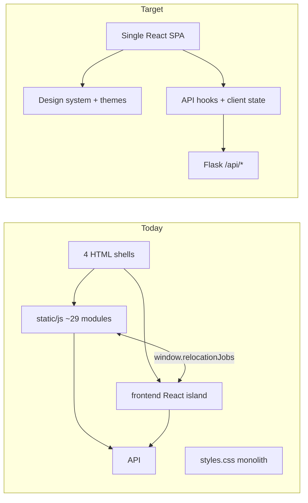

# Full SPA UI modernization — proposal

**Status:** proposal (not approved)  
**Last updated:** 2026-07-08  
**Authors:** architecture discussion (agent + owner review pending)

Related: [architecture.md](architecture.md), [board.md](board.md), [business-rules.md](business-rules.md), [company-workspace.md](company-workspace.md), [rules.md](rules.md), [board-read-model-proposal.md](board-read-model-proposal.md)

---

## Summary

The panel UI is a **hybrid multi-page app**: four static HTML shells, ~8,500 lines of vanilla ES modules, and a partial React island on the main board only. Styling is a single ~6,000-line `styles.css`. React and vanilla JS communicate through `window.relocationJobs` and delegated DOM clicks in `events.js` (~865 lines).

**Recommended direction (default):** replace the hybrid front with a **single React SPA** (Vite), shared **AppShell** layout, **React Router** for all four views, a **design system** (Tailwind + shadcn/ui), **dark + light themes** with system preference, and **mobile-first** responsive patterns. Flask stays a JSON API; add an SPA fallback route. Migrate **page-by-page** over ~8–10 weeks; delete legacy `static/js/`, per-page HTML, and monolithic CSS after cutover.

**Testing stance:** do **not** retroactively test the legacy hybrid front (throwaway code). Add a **thin safety net on the new stack** during migration: Vitest for pure helpers + optimistic cache logic; 3–5 Playwright smoke tests after Phase 1; keep existing pytest API/board tests green.

**Not recommended now:** TypeScript mid-migration; Tailwind line-by-line port of `styles.css`; changing API contracts; blocking the rewrite on legacy front test coverage.

**Decision needed:** approve phased SPA rewrite vs smaller incremental polish (design tokens only, keep hybrid) — see [Decision: scope](#decision-scope).

---

## Problem statement

### What the UI is today

```text
Flask (relocation_jobs/web/server.py)
  → static HTML shells (index, company, apply, admin)
  → static/js/ (~29 ES modules) — auth, filters, dialogs, board logic, admin, apply, company
  → frontend/ (Vite + React 19) — board cards, pagination, fetch panel only on /
  → static/styles.css (~6k lines, dark theme only)
  → /api/* JSON
```

| Route | Shell | UI stack |
|-------|-------|----------|
| `/` | `index.html` | Vanilla + React island |
| `/company/<country>/<slug>` | `company.html` | 100% vanilla JS |
| `/apply` | `apply.html` | 100% vanilla JS |
| `/admin` | `admin.html` | 100% vanilla JS |

React mounts via portals into holes in `index.html` (`#jobs`, `#board-pagination-root`, `#fetch-header-root`, `#fetch-panel-root`). Vanilla owns header, filters, search, sort, dialogs, auth, and all event handling. State crosses the boundary through `board-sync.js`, `fetch-sync.js`, and `window.relocationJobs`.

### Pain points

1. **Two rendering paradigms** — React components are presentational; behavior lives in `events.js` global click delegation. Hard to reason about, test, or extend.
2. **Monolithic CSS** — ~6,000 lines, no spacing/type scale tokens, hardcoded hex mixed with CSS variables, high risk of regressions on any edit.
3. **Duplication** — fetch panel exists in React (`FetchPanel.jsx`) and admin HTML (`admin-worker.js`); `companyWorkspacePath()` duplicated in React and vanilla.
4. **No shared chrome** — each page reloads; header/nav not DRY across four shells.
5. **Dark theme only** — no light mode or `prefers-color-scheme` support.
6. **Mobile patterns are manual** — bottom sheets, scroll lock, and popover positioning implemented ad hoc in vanilla JS.
7. **No frontend tests** — zero Vitest/Playwright; pytest covers API and panel flatten logic only.

### What does *not* need to change

| Area | Why leave it |
|------|--------------|
| Flask `/api/*` contracts | SPA consumes same endpoints; business rules stay server-side |
| Postgres catalog + tracking | Source of truth unchanged |
| `panel/flatten.py` board logic | Server read model; see [board-read-model-proposal.md](board-read-model-proposal.md) for performance work (orthogonal) |
| MCP / fetch worker backends | UI rewrite does not replace fetch pipeline |

---

## Options considered

### A. Design-system polish only (keep hybrid)

Improve `styles.css` tokens, unify buttons/badges, tighten mobile breakpoints. Keep React island + vanilla JS bridge.

| Pros | Cons |
|------|------|
| Lowest risk, ~2–4 weeks | Does not fix `events.js` coupling or four-page duplication |
| No Flask routing change | Still two paradigms; harder to hire/contribute |
| | Light theme still awkward across 6k-line CSS |

### B. Expand React gradually (recommended intermediate if SPA feels too big)

Migrate board → company → apply → admin into React behind existing HTML shells; retire vanilla page by page.

| Pros | Cons |
|------|------|
| Deployable increments | Still multi-page until router lands |
| Proves React patterns before full cutover | Temporary dual stack longer than full SPA shell-first |

### C. Full SPA rewrite (recommended default)

Single Vite build, React Router, shared AppShell, delete vanilla layer after migration.

| Pros | Cons |
|------|------|
| Removes `window.relocationJobs` and `events.js` permanently | ~8–10 weeks; large parallel track |
| One design system, one test strategy | Regression risk during migration (mitigated below) |
| Professional mobile + dark/light in one place | Requires Flask SPA fallback route |

### D. Full rewrite + TypeScript

Same as C but port to `.tsx` during migration.

| Pros | Cons |
|------|------|
| Stronger types long-term | ~30–50% more migration friction; defer until SPA is stable |

---

## Decision: scope

| Choice | When |
|--------|------|
| **C — Full SPA** | Owner wants production-grade UI, mobile, themes, and maintainability; accepts 8–10 week track |
| **A — Polish only** | Reliability/backend work is higher priority; UI refresh is cosmetic |
| **B — Gradual React** | Want smaller PRs but eventually reach SPA |

**Owner preference (2026-07-08):** full SPA + dark/light themes.

---

## Recommended stack

| Layer | Choice | Why |
|-------|--------|-----|
| **Router** | React Router v7 | Mirrors `/`, `/company/:country/:slug`, `/apply`, `/admin` |
| **Styling** | Tailwind CSS v4 + CSS variables | Token-based theming; component-scoped utility |
| **Primitives** | shadcn/ui (Radix) | Dialog, Sheet, Select, Dropdown, Toast — accessible defaults |
| **Server state** | TanStack Query | Board pagination, admin tables, fetch runs |
| **Client state** | Zustand (light) | Auth session, filter prefs (`storage.js` today), theme override |
| **Icons** | lucide-react | Replace duplicated inline SVGs |
| **Build** | Existing Vite → `relocation_jobs/static/dist/` | Deploy path unchanged |

---

## Design direction

### Visual language

- **Typography:** 12 / 14 / 16 / 20 / 24px scale; Inter (UI), JetBrains Mono (slugs/code).
- **Spacing:** 4px base grid (4, 8, 12, 16, 24, 32, 48).
- **Surfaces:** three elevation levels (page → card → popover); subtle borders over heavy shadows.
- **Color:** semantic tokens for both themes (`background`, `foreground`, `muted`, `accent`, `success`, `warn`, `danger`, `visa`, `referral`); remove raw hex in badges.
- **Density:** comfortable desktop; 44px min touch targets on `pointer: coarse`.

### Dark + light theme

- `data-theme="dark" | "light"` on `<html>`.
- Default from `prefers-color-scheme`; override in `localStorage`.
- Theme toggle in account menu; inline anti-FOUC script in SPA shell.
- Verify contrast for ATS rings, visa/referral chips, and badges in both modes.

### Mobile-first layout

- **AppShell:** sticky header, safe-area insets, max-width columns (1080px board, 1280px workspace).
- **Board filters:** desktop inline toolbar; mobile bottom **Sheet** with chip summary (replace `lockBodyScroll` + manual backdrop).
- **Job actions:** wrap to 2-col at `md`, 1-col at `sm`.
- **Company workspace:** sidebar + detail → stacked below `lg`.
- **Admin tables:** horizontal scroll + sticky first column; optional card list later.

### UX polish

- Skeleton loaders per page (extend `BoardSkeleton.jsx`).
- Empty states with clear CTAs.
- Optimistic updates via TanStack Query `onMutate` / `setQueryData` (port `job-board.js` logic).
- `prefers-reduced-motion` for sheets and loaders.
- Focus traps on Dialog/Sheet; `focus-visible` on all interactives.

---

## Target architecture



### Frontend layout (new)

```text
frontend/src/
  app/           App.jsx, router, providers (Query, theme, auth)
  layouts/       AppShell, AuthGate
  pages/         BoardPage, CompanyPage, ApplyPage, AdminPage
  features/      board/, company/, apply/, admin/, fetch/, auth/
  components/ui/ shadcn primitives
  lib/           api client (from api.js), query keys, formatters
  hooks/         useBoard, useJobMutations, useTheme, …
  styles/        globals.css (theme tokens), tailwind config
```

### Flask changes (minimal)

In `relocation_jobs/web/server.py`:

- Serve **one** SPA shell for `/`, `/admin`, `/apply`, `/company/<country>/<path:slug>`.
- Keep `/static/dist/*` and `/api/*` unchanged.
- Retire per-page HTML routes after each phase.

### Delete after cutover

- `relocation_jobs/static/*.html` (except SPA shell)
- `relocation_jobs/static/js/*` (entire vanilla layer)
- `relocation_jobs/static/styles.css`
- `window.relocationJobs` bridge (`board-sync.js`, `fetch-sync.js`)

---

## Phased migration (~8–10 weeks)

Each phase ends deployable; production stays usable throughout.

### Phase 0 — Foundation (week 1–2)

- Add Tailwind, shadcn/ui, React Router, TanStack Query, lucide-react.
- Theme tokens (dark/light); `AppShell` with header, user menu, theme toggle, nav.
- Port `api.js` → `lib/api.js`; `auth.js` → `AuthGate`.
- Flask SPA fallback; Vite dev proxy to `:5051`.
- **Deliverable:** authenticated shell with theme toggle; placeholder routes.

### Phase 1 — Job board (week 3–5)

| Today | Target |
|-------|--------|
| `filters.js` + HTML toolbar | `BoardToolbar` + filter Sheet |
| `board.js`, `board-view.js` | `useBoardQuery` + pagination |
| `events.js` delegated clicks | `useJobMutations` in `JobCard` / `CompanyCard` |
| `dialogs.js` (~1,154 lines) | `AddCompanyDialog`, `EditCareersDialog`, `EditCityDialog` |
| `FetchPanel.jsx` + `scrape.js` | `useFetchRun`; single fetch UI |
| `job-board.js` optimistic patches | Query `onMutate` / `setQueryData` |

Refactor existing React components to **own interactions** (no `data-action` delegation).

**Deliverable:** `/` fully functional in SPA; legacy board JS removable.

### Phase 2 — Company workspace (week 6–7)

Port `company.js` (~621 lines): position list, LaTeX editor, PDF preview, MCP actions. Route `/company/:country/:slug`. Merge duplicate `companyWorkspace.js`.

**Deliverable:** CV tailoring in SPA.

### Phase 3 — Application data (week 8)

Port `apply.js`: profile form, master resume editor, pipeline prompts. Optional React Hook Form.

**Deliverable:** `/apply` in SPA.

### Phase 4 — Admin (week 9–10)

Port `admin.js`, `admin-worker.js`, `stats-dashboard.js`. Reuse fetch panel from Phase 1.

**Deliverable:** `/admin` in SPA; delete legacy static JS/HTML.

### Phase 5 — Polish (final week)

- Accessibility audit (keyboard, focus traps, labels).
- Mobile QA (iOS Safari safe areas, sheets).
- Route-based code splitting (`React.lazy`).
- Bundle size / lucide tree-shaking.
- Update `architecture.md`; adjust deploy if SPA shell name changes.

---

## Testing strategy

### Do not do

- Retroactive unit/e2e tests for legacy `static/js/` or the React↔vanilla bridge.
- Block Phase 0 on front test coverage.

**Rationale:** legacy front is throwaway (~8,500 LOC). Backend pytest already guards API routes (`tests/test_route_manifest.py`), panel flatten (`tests/panel/`), and business rules. The SPA rewrite **improves** testability by colocating behavior in hooks/components.

### Do during migration

| Layer | Tool | Scope | When |
|-------|------|-------|------|
| Pure logic | Vitest | `format.js`, `sort.js`, optimistic cache helpers | Phase 0–1 |
| Critical flows | Playwright (3–5 tests) | Login → board load; apply toggle persists; filter + paginate; optional company workspace | After Phase 1 |
| API contract | pytest (existing) | Route manifest, board flatten, mutations | Every phase |

### Playwright smoke list (minimum)

1. Login → board renders companies.
2. Toggle applied on a job → persists after reload.
3. Change filter + page → correct slice shown.
4. (Optional) Open company workspace → positions list loads.

### Regression checklist (manual + Playwright)

Map to [business-rules.md](business-rules.md): apply, reject, not-for-me, restore, pin, ATS score, hide-reason, orphan reinjection visible on board.

---

## Risks and mitigations

| Risk | Mitigation |
|------|------------|
| `events.js` behavior regression | Migrate action-by-action; checklist vs business-rules |
| Optimistic board updates wrong bucket | Port `patchJobOnBoard` into query cache helpers before deleting `job-board.js` |
| Fetch polling stuck / double poll | Isolate `useFetchPolling`; mock poll in Vitest |
| 6k-line CSS delete | Rebuild with shadcn + tokens; port only ATS ring, visa badges |
| Long admin migration | Admin last; board + company = 90% daily use |
| Deploy breakage | SPA shell first; optional feature flag for old HTML one release |
| Parallel backend reliability work | UI rewrite does not fix board load perf — coordinate with [board-read-model-proposal.md](board-read-model-proposal.md) |

---

## What “done” looks like

- One Vite build → `relocation_jobs/static/dist/`.
- Four React Router routes; shared AppShell on every page.
- Dark + light themes; system default + manual override.
- Mobile: usable filters, job actions, company workspace without horizontal scroll pain.
- No `window.relocationJobs`, no `events.js`, no duplicate fetch panel.
- API and business rules unchanged; pytest green; Playwright smoke green.

---

## Suggested first PR

1. Tooling + theme tokens + `AppShell` + Flask SPA fallback.
2. Login/auth gate against existing `/api/auth/*`.
3. Board route renders existing React `App` inside new layout (proves integration before deleting vanilla).

Visible progress on day one without big-bang cutover.

---

## Open questions

1. **Timing vs board performance** — start SPA while [board-read-model-proposal.md](board-read-model-proposal.md) is in flight, or sequence after read-model lands?
2. **Feature flag** — keep old HTML shells for one release behind env flag?
3. **React Hook Form** — adopt in Phase 3 apply page or stay uncontrolled + manual validation?
4. **Admin table density** — horizontal scroll only, or card fallback on mobile in v1?
