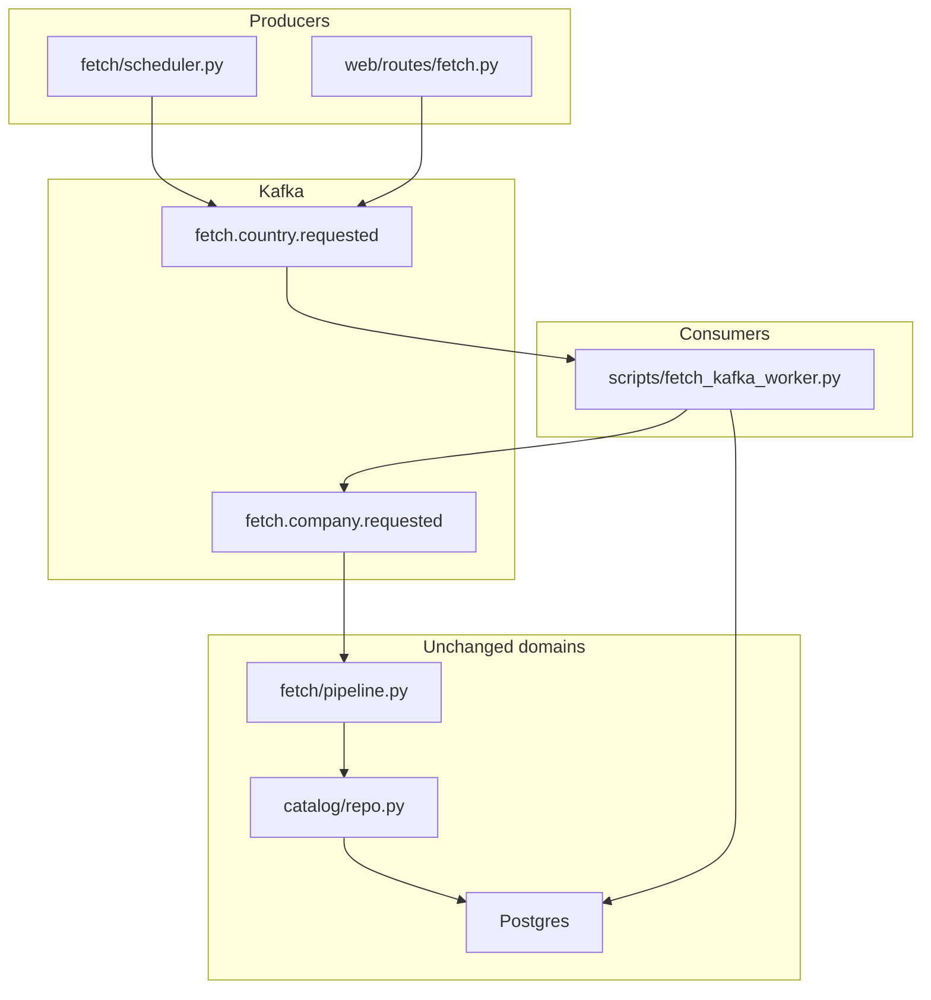

# Kafka / work-queue — fetch pipeline proposal

**Status:** proposal (not approved)  
**Last updated:** 2026-07-08  
**Authors:** architecture discussion (agent + owner review pending)

Related: [architecture.md](architecture.md), [rules.md](rules.md), [ec2-panel.md](../operations/ec2-panel.md), [stats.md](stats.md), [board-read-model-proposal.md](board-read-model-proposal.md)

---

## Summary

The app has **no message broker today**. Async work is limited to the **fetch/scrape pipeline**: a 6-hour EC2 scheduler, optional manual admin fetch, and in-process threads writing to Postgres. **Kafka (or a lighter queue) belongs at that boundary only** — not on the board, user tracking, or MCP paths.

**Recommended direction (default):** do **not** add Kafka until fetch scaling or multi-consumer fan-out is a real requirement. If a queue is needed sooner, prefer a **Postgres job table** or **Redis Streams** on the existing EC2 host. If Kafka is adopted, place infra in `core/kafka_client.py`, contracts in a new `events/` domain, producers at `fetch/scheduler` + `web/routes/fetch`, consumers in `scripts/*_worker.py`; keep `fetch_runs` as durable audit.

**Not recommended:** Kafka for board reads (see [board-read-model-proposal.md](board-read-model-proposal.md)); Kafka for MCP application queue (that name is a user list, not a work queue); replacing Postgres as source of truth for catalog or tracking.

**Decision needed:** stay on current thread model vs **Postgres queue** vs **Redis Streams** vs **Kafka** — see [Decision: broker choice](#decision-broker-choice).

---

## Problem statement

### What async work exists today

Only the **fetch pipeline** runs outside the HTTP request/response path:

```text
Trigger (scheduler or POST /api/fetch)
  → fetch/runner.py (threading.Thread)
  → fetch/country_runner.py (ThreadPoolExecutor + asyncio per company)
  → fetch/pipeline.py → scrape/company.py
  → catalog/repo.sync_company_board_to_catalog
  → Postgres (catalog + fetch_runs + company_fetch_attempts)
```

Production runs this in a **separate container** (`relocation-fetch-worker`, `Dockerfile.ec2-worker`). The panel container has `PANEL_SCRAPE_ENABLED=0` and does not scrape ([ec2-panel.md](../operations/ec2-panel.md)).

Everything else — `GET /api/board`, apply/reject/not-for-me, MCP tools — is **synchronous Postgres** on the request thread.

### Coordination model (evidence)

| Mechanism | Location | Effect |
|-----------|----------|--------|
| Global fetch mutex | `fetch_runs.status = 'running'` via `fetch/repo.get_running_fetch_run()` | At most one fetch run system-wide |
| In-process state | `fetch/state.py` (`threading.RLock`, `_fetch_thread`) | Live progress accurate only in the process that started the fetch |
| Scheduler serializes countries | `fetch/scheduler.py` — `wait_for_fetch_thread()` after each country | Countries run one after another within a cycle |
| Busy skip | `scheduler.run_fetch_cycle()` lines 72–74, 90–96 | Entire cycle or remaining countries skipped if another fetch is running |
| Redis | `catalog/custom_countries.py` — `countries:labels` hash only | **Not** used for job dispatch; fetch worker does not require `REDIS_URL` |
| Admin progress | `GET /api/fetch/status` polled ~800ms | Reads Postgres + in-process state, not a stream |

### Pain points a queue could address

1. **Cross-process contention** — manual panel fetch and scheduled worker block each other via `fetch_runs`.
2. **No durable per-company work queue** — crash mid-country loses unprocessed companies; `reap_orphan_running_fetch_runs()` marks all `running` rows failed on restart.
3. **No horizontal scale** — one worker process on `t4g.micro`; docs note OOM at concurrency 4.
4. **Sequential country scheduling** — intra-country parallelism exists; inter-country does not.
5. **Disconnected catalog build** — `build_companies.py` is a manual CLI, not part of the scheduler pipeline.
6. **No retry/DLQ** — failures logged in `company_fetch_attempts` but not re-queued.

### What does *not* need a queue (evidence)

| Area | Why sync Postgres is enough |
|------|-----------------------------|
| Board (`panel/service.py`, `GET /api/board`) | Read-heavy derived view; slowness is re-flattening, not missing async infra — see [board-read-model-proposal.md](board-read-model-proposal.md) |
| User tracking (`positions/`) | Low-volume mutations; request/response |
| MCP `list_application_queue` | Discovery list of pinned/looking-to-apply jobs — not scrape dispatch ([mcp-application.md](mcp-application.md)) |
| MCP reframe / PDF | Interactive single-user tools |
| `job_status_events` | Append-only audit already in Postgres (`core/migrations.py`) |

---

## Options considered

### A. Status quo (in-process threads + `fetch_runs`)

Keep `fetch/runner.py` thread model; tune concurrency and instance size.

| Pros | Cons |
|------|------|
| Zero new infra | Global mutex; no scale-out; brittle orphan handling |
| Already shipped on EC2 | Panel and worker still contend on `fetch_runs` |

**Fit:** current single-tenant, 6h batch, one worker.

### B. Postgres-backed job table (recommended first step if queue needed)

`fetch_jobs` table: `(id, kind, country, company_name, status, attempts, payload_json, …)`. Scheduler and API **enqueue**; worker **claims** rows with `FOR UPDATE SKIP LOCKED`.

| Pros | Cons |
|------|------|
| Same host as catalog; no new service | Not ideal for many independent consumers |
| Transactions with catalog writes | Replay/streaming weaker than Kafka |
| Matches layer rules (`fetch/repo.py`) | |

**Fit:** retry, per-company durability, modest parallelism — without Kafka ops.

### C. Redis Streams

Use existing `relocation-redis` on EC2 for `XADD` / consumer groups.

| Pros | Cons |
|------|------|
| Already deployed for country labels | Another persistence model beside Postgres |
| Lower ops than Kafka | Less durable replay than Kafka; memory-bound |
| Good for progress fan-out | Not ideal if Redis is cache-only by policy |

**Fit:** decouple enqueue from execute on same host; optional live progress stream.

### D. Kafka

Managed (Confluent / MSK) or self-hosted broker; topics for country/company work and optional catalog events.

| Pros | Cons |
|------|------|
| Multi-consumer fan-out (metrics, search index, workers) | Heavy for `t4g.micro` single worker |
| Partitioned scale-out, replay, DLQ topics | New deploy surface, monitoring, cost |
| Clean panel ↔ worker decoupling | Overkill until >1 consumer type or many workers |

**Fit:** multiple worker replicas, event replay, downstream systems subscribing to catalog changes.

---

## Decision: broker choice

| If you need… | Prefer |
|--------------|--------|
| Per-company retry + survive restarts, same EC2 | **B — Postgres job table** |
| Live admin progress without polling Postgres | **C — Redis Streams** (progress topic) or SSE from worker |
| Multiple worker containers + metrics/search consumers | **D — Kafka** |
| Nothing broken yet at current scale | **A — status quo** |

**Default recommendation:** **A** today; **B** when fetch reliability/parallelism becomes painful; **D** only when multi-consumer or multi-region scale is explicit.

---

## Proposed code layout (if Kafka or generic events)

Follow v2 boundaries ([rules.md](rules.md)): SQL in `*/repo.py`, orchestration in services/pipelines, infra clients in `core/`.

```
relocation_jobs/
├── core/
│   └── kafka_client.py       # KAFKA_BOOTSTRAP_SERVERS gate (mirror redis_client.py)
├── events/                   # new domain — no SQL
│   ├── types.py              # Pydantic envelopes
│   ├── topics.py
│   ├── publisher.py
│   └── consumer.py
├── fetch/                    # existing scrape orchestration unchanged at pipeline boundary
│   ├── scheduler.py          # producer: enqueue country work
│   ├── runner.py             # consumer calls this, not thread spawn
│   └── pipeline.py           # process_company — already the right seam (ports.py)
scripts/
├── fetch_scheduler_worker.py # producer cron (or merged with consumer)
└── fetch_kafka_worker.py     # consumer entrypoint (new)
```

**Producers:** `fetch/scheduler.py`, `web/routes/fetch.py`  
**Consumers:** `scripts/fetch_kafka_worker.py` → `fetch/pipeline.fetch_and_persist_company`  
**Unchanged:** `catalog/repo.py`, `scrape/company.py`, `panel/`, `positions/`, `mcp/`

**Postgres stays:** `fetch_runs`, `company_fetch_attempts` for admin dashboard and audit even with Kafka.

### Topic sketch (Kafka only)

| Topic | Publisher | Consumer |
|-------|-----------|----------|
| `fetch.country.requested` | scheduler, admin API | worker: fan out companies |
| `fetch.company.requested` | country fan-out | worker: run pipeline |
| `fetch.company.completed` / `failed` | pipeline | progress aggregator, DLQ |
| `fetch.run.progress` (optional) | worker | admin SSE |

Partition key: `country` or `company_name` for ordering per company.

---

## Architecture (target, if Kafka)



---

## Phased rollout (if approved)

### Phase 0 — Document and measure

- Baseline: fetch cycle duration, orphan rate, 409 busy rate, worker OOMs ([ec2-panel.md](../operations/ec2-panel.md)).
- Confirm whether pain is concurrency, mutex, or catalog write contention ([aws-postgres.md](../operations/aws-postgres.md) notes per-thread DB connections).

### Phase 1 — Postgres job queue (optional, broker-agnostic)

- Add `fetch_jobs` table + claim loop in worker.
- Scheduler enqueues countries/companies instead of `start_country_fetch` + `wait_for_fetch_thread`.
- Keep `fetch_runs` for run-level UI.

### Phase 2 — Kafka (only if Phase 1 outgrows Postgres queue)

- `core/kafka_client.py` + `events/`.
- Replace enqueue path with topic publish; consumer group in `Dockerfile.ec2-worker`.
- Idempotent handlers keyed by `(run_id, company_name)`.

### Phase 3 — Optional fan-out

- `CatalogCompanySynced` → search index, notifications (features do not exist today).

---

## Deploy notes

- Broker **outside** the Python package: EC2 compose, Confluent Cloud, or MSK.
- Panel container: `KAFKA_BOOTSTRAP_SERVERS` only if it publishes (manual fetch).
- Worker container: consumer + Playwright (existing `Dockerfile.ec2-worker`).
- Tests: `reset_kafka_client()` in `conftest.py`; use testcontainers or mock producer (same pattern as Redis).

---

## Open questions

1. Is fetch mutex / orphan handling actually painful in production, or theoretical?
2. Target concurrency: stay at 4 on micro, or plan for 16+ with larger instance?
3. Should `build_companies.py` join the same pipeline (discover → fetch → enrich)?
4. Any second consumer in the next 12 months (search, alerts, analytics)?

---

## Done when

- [ ] Broker choice decided (A / B / C / D)
- [ ] If B+: job schema + idempotency rules documented
- [ ] If D: topics, consumer group, deploy runbook in [ec2-panel.md](../operations/ec2-panel.md)
- [ ] Parity: admin `worker` stats and `GET /api/fetch/status` unchanged or intentionally migrated
- [ ] Tests: enqueue → process → catalog row + `company_fetch_attempts`
