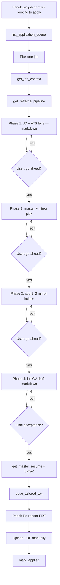

# MCP application assistant (v0)

**Last updated:** 2026-07-02

Plan and reference for the `relocation_jobs/mcp/` domain: a local MCP server for **Claude Desktop** that prepares tailored resume PDFs for jobs on the panel. v0 does **not** submit applications automatically and does **not** use the Claude API — Claude Desktop (subscription) does the resume reframing in chat; this app supplies data, validation, PDF rendering, and board state updates.

**Private data is stored in Postgres per user — nothing sensitive is committed to git.**

Use the panel **Application data** page at `/apply` (also linked from the account menu) to edit your profile, **pipeline prompts**, and master resumes in the browser. Claude Desktop MCP tools read the same data for the configured MCP user (`MCP_USERNAME` / `MCP_USER_ID` env).

Related: [architecture.md](architecture.md), [business-rules.md](business-rules.md), [contributing.md](../contributing.md).

**Claude skill:** [`.claude/skills/mcp-resume-reframe/SKILL.md`](../../.claude/skills/mcp-resume-reframe/SKILL.md) — **interactive** gated reframe (one phase per turn, user approval), **additive** JD-mirror bullets on the full master CV (never remove responsibilities without permission), `save_tailored_tex` after final sign-off; PDF render on the panel.

---

## Goals (v0)

| In scope | Out of scope (later) |
|----------|----------------------|
| MCP tools for job context, queue, multi-master resumes | Headless Claude API orchestration |
| Master `.tex` + tailored `.tex` per job in DB | Browser auto-submit (Playwright) |
| Deterministic validation before PDF render | ATS-specific form fillers |
| Local LaTeX → PDF (`tectonic` / `pdflatex`) | Batch unattended apply |
| `mark_applied` via existing `positions` service | Keyword scoring / auto-fetch JD in chat |

---

## Architecture

```text
Claude Desktop
        ▼
scripts/mcp_server.py  (stdio MCP)
        ▼
relocation_jobs/mcp/
  server.py      MCP tools
  service.py     Orchestration (no SQL)
  repo.py        Postgres
  validate.py    Structure + fact checks vs master
  render.py      LaTeX compile (temp dir)
        │
        ├── catalog/repo
        ├── positions/service
        └── users/repo
```

---

## Database schema

Migrations: `mcp_tables_v1`, `mcp_master_resumes_v2`.

### `mcp_master_resumes`

| Column | Purpose |
|--------|---------|
| `user_id` + `slug` | PK — e.g. `go`, `java`, `fullstack` |
| `label` | Display name |
| `content` | Master `.tex` |

### `mcp_user_documents`

Profile (`profile_json`), including optional `pipeline` — up to 5 ordered prompt strings run before resume reframing.

### `mcp_applications`

| Column | Purpose |
|--------|---------|
| `master_resume_slug` | Variant used for this application |
| `tailored_tex`, `pdf_bytes`, `meta_json` | Application artifacts |

---

## MCP tools

| Tool | Purpose |
|------|---------|
| `get_job_context` | Job + tracking + `description_text` (JD), `has_description` / `needs_fetch`, `master_resume_slug`, `has_tailored_tex` / `has_pdf`, `can_save_tailored_tex` |
| `list_application_queue` | Pinned + looking-to-apply jobs (discovery only — not required to save) |
| `list_master_resumes` | All master variants |
| `get_master_resume` / `save_master_resume` | Read/write master tex by slug |
| `get_mcp_status` | Debug: MCP user + profile/resume presence + `pipeline_prompt_count` |
| `get_application_profile` / `save_application_profile` | Profile fields; `pipeline` array on profile |
| `get_reframe_pipeline` | Ordered pipeline prompts only (alias of profile.pipeline) |
| `save_tailored_tex` | Requires `master_resume_slug`; overwrites prior tailored tex; queue membership not required |
| `validate_tex` | Structure + fact checks vs master |
| `render_pdf` | Compile → store PDF bytes |
| `mark_applied` | Panel tracking |
| `list_supported_countries` | Country keys for `add_company` (germany, netherlands, uk, portugal) |
| `list_ats_types` | ATS ids for `add_company` (`auto` detects from careers URL) |
| `add_company` | Add employer to catalog — same flow as panel **Add company** (name, careers URL, optional country/ATS/locations) |

### Panel integration (company workspace)

MCP writes artifacts to Postgres; the panel reads them via HTTP (same user session as `/apply`).

| Panel surface | Purpose |
|---------------|---------|
| `/apply` | Profile, pipeline prompts, master resumes (setup) |
| `/company/<country>/<company-slug>` | Per-company workspace: positions, tailored tex, PDF preview — see [company-workspace.md](company-workspace.md) |
| Job board (phase 3) | CV/PDF badges; company name → workspace |

Web API (login required): `GET /api/mcp/companies/<country>/<company>/applications`, `GET/POST /api/mcp/applications/<idempotency_key>/…` — documented in [company-workspace.md](company-workspace.md).

Claude Desktop owns reframing (`save_tailored_tex` after user approval); the panel **renders PDF** (Re-render PDF) to save tokens in chat.

### End-to-end flow (position → pipeline → reframe)

One job from queue to tailored PDF. Claude runs **one pipeline prompt per turn** with a user checkpoint; MCP supplies job, profile, prompts, and master tex.



#### 0. One-time setup (`/apply`)

1. Save **master resume(s)** (e.g. `go`, `java`, `fullstack`).
2. Save **application profile** (name, email, …).
3. Add **five pipeline prompts** (one phase each) from [`.claude/skills/mcp-resume-reframe/pipeline-prompts.md`](../../.claude/skills/mcp-resume-reframe/pipeline-prompts.md). Each slot ends with a **go ahead?** checkpoint — do not use a single consolidated auto-run prompt.

#### 1. Pick a position

**Option A — from queue**

```text
list_application_queue(country="uk")   # optional country filter
```

Returns pinned and looking-to-apply jobs with `country`, `company`, `url`, `title`.

**Option B — you already know the job**

Use `country`, `company`, and `url` from the panel board.

#### 2. Load job context

```text
get_job_context(country, company, url)
```

Use `title`, `ats_url`, flags (`looking_to_apply`, `pinned`, `in_application_queue`), `can_save_tailored_tex`, and whether tailored tex/PDF already exist.

**Job description:** use `description_text` from this response as the JD for all pipeline phases — do **not** open or scrape the posting URL in chat. When `has_description` is false (`needs_fetch` is true), ask the user to open the company workspace for this position and click **Fetch job description** (or re-run catalog enrich locally), then call `get_job_context` again before phase 1.

`can_save_tailored_tex` is true whenever the job is in the catalog. **Re-runs and overwrites do not require** pinned or looking-to-apply — call `save_tailored_tex` with the `url` / `country` / `company` from this response.

#### 3. Load profile and pipeline prompts

```text
get_reframe_pipeline()
```

or

```text
get_application_profile()   # pipeline is a field on the response
```

**There is no `run_pipeline` tool.** Pipeline prompts are stored in Postgres and returned by the tools above. Claude must run each string in `pipeline[]` **in order in chat** before reframing `.tex`.

Example `get_reframe_pipeline()` response:

```json
{
  "pipeline": [
    "List the top 5 skills this role needs.",
    "Map my experience to those skills.",
    "Reframe the resume emphasizing matches without new facts."
  ],
  "count": 3,
  "run_in_order": true
}
```

Quick sanity check: `get_mcp_status()` → `pipeline_prompt_count` (count only, not text).

#### 4. Run the pipeline (in Claude chat) — one phase per turn

For each string in `pipeline[0]`, `pipeline[1]`, … **in order**:

1. Run **only that phase** for this job (use `get_job_context.description_text` as the JD + masters as needed).
2. Output **markdown** (not LaTeX) until the final phase.
3. End with **go ahead?** and **wait** for the user before the next phase.
4. **Mirror additions (phase 3):** add **1–2 new bullets** to one real role for ATS/JD similarity — **all master bullets kept**. User approves new bullets in phase 2–3. Never remove or shorten master content without explicit user approval.
5. **Final acceptance** on the full markdown draft (master + additions) before any `.tex` work.

There is no `run_pipeline` MCP tool. Use `get_reframe_pipeline` or `get_application_profile().pipeline`.

#### 5. LaTeX + save (after final acceptance)

```text
get_master_resume("<slug>")    # chosen in phase 2
save_tailored_tex(country, company, url, content, master_resume_slug="java")
validate_tex(...)              # optional in chat; fix blocking issues
```

Use the chosen master's LaTeX structure (preamble, macros, sections). Employers and dates stay fixed. **Copy all master content**; apply only approved additions (new mirror bullets, optional summary tweak, skills reorder).

#### 6. Render PDF on the panel

Do **not** call `render_pdf` in Claude by default — open the company workspace and **Re-render PDF** (saves tokens). Call `render_pdf` in chat only if you explicitly want it.

#### 7. After applying

Upload the PDF to the ATS manually, then:

```text
mark_applied(country, company, url, applied=true)
```

#### Add a company (panel parity)

Same inputs as the panel **Add company** dialog:

```text
list_supported_countries()          # optional — country hints
list_ats_types()                    # optional — or use ats="auto"
add_company(
  name="Example GmbH",
  careers_url="https://boards.greenhouse.io/example",
  country="germany",                # or "auto" / omit to detect
  ats="auto",                       # or greenhouse, lever, ashby, …
  locations_json='[{"country":"germany","city":"Berlin"}]'  # optional
)
```

Returns `workspace_path` (e.g. `/company/germany/example-gmbh`) for the panel company workspace. After adding, run a **Fetch** on the panel (or `scrape_jobs.py`) to load open roles.

#### Paste into Claude Desktop

```text
Apply using the mcp-resume-reframe skill to the first job in my UK queue:
1. list_application_queue(country="uk") and pick one job
2. get_job_context + get_reframe_pipeline — use description_text as the JD
3. If has_description is false, ask me to fetch the JD on the panel before phase 1
4. Run pipeline phase 1 only — markdown, then ask me to go ahead
5. Continue one phase per turn until I accept the full draft
6. save_tailored_tex after final acceptance — do not render_pdf; I'll render on the panel
```

### Workflow (short)

1. Setup on `/apply`: master resumes + profile + **five** gated pipeline prompts.
2. Pin job or mark **looking to apply** on the panel.
3. Claude: bootstrap MCP → **one phase per turn** → user checkpoints → **add** mirror bullets to master (never trim without permission).
4. After final acceptance: `save_tailored_tex` → optional `validate_tex`.
5. Panel: **Re-render PDF** → upload manually → `mark_applied`.

---

## Validation

1. **Structure** — document env, balanced `\begin`/`\end`, max 400 lines.
2. **Facts** — no new years or employers vs the chosen master resume.

---

## Configuration

| Variable | Default | Purpose |
|----------|---------|---------|
| `MCP_USERNAME` | `admin` | Panel user |
| `MCP_USER_ID` | (unset) | Override user id |
| `MCP_LATEX_CMD` | `tectonic` | LaTeX binary |
| `DATABASE_URL` | (required) | Same as panel |

### Troubleshooting

**Profile or resumes look empty / null in Claude**

1. Call `get_mcp_status` — shows which panel user MCP reads (`user_id`, `username`) and whether profile / master resumes exist.
2. MCP defaults to `MCP_USERNAME=admin`. Data saved on `/apply` is per **logged-in panel user**. If you sign in as a different account, set `MCP_USERNAME` (or `MCP_USER_ID`) in Claude Desktop’s MCP server `env` to match.
3. Ensure Claude Desktop’s MCP config includes the same `DATABASE_URL` as the panel (`.env` is loaded from the repo root by `scripts/mcp_server.py`, but explicit `env` in the config is clearer).

**Claude says there is no pipeline tool**

Correct: there is no `run_pipeline` tool. Prompts are **data**, not an executable tool.

1. Call **`get_reframe_pipeline`** (or **`get_application_profile`** and read the `pipeline` field).
2. Run each string in `pipeline[]` **in order in chat** before `get_master_resume` / reframing.
3. Restart Claude Desktop (or reload MCP) after server updates so `get_reframe_pipeline` appears in the tool list.

**`get_job_context` shows `null` for `visa_sponsorship` or `ats_score`**

Normal when the catalog or your tracking has no value for those fields.

**`description_text` is empty / `needs_fetch` is true**

The JD is not stored in the catalog yet. On the panel, open `/company/<country>/<company-slug>`, select the position, click **Fetch job description**, then call `get_job_context` again. Do not scrape the ATS URL in Claude chat. After a local enrich run, `description_text` is filled automatically for newly fetched jobs.

**Tailored CV not visible on company workspace**

1. Confirm MCP and panel use the **same user** (`get_mcp_status` → `username` must match your panel login; set `MCP_USERNAME` in Claude Desktop config if not `admin`).
2. Country keys are stored **lowercase** (`germany`, not `Germany`). Older rows are fixed by migration `mcp_applications_country_lower_v1`; new saves normalize automatically.
3. Open `/company/<country>/<company-slug>` (e.g. `/company/germany/talon.one`) and select the **exact position** Claude tailored — CV badge appears per role, not per company.
4. `has_tailored_tex` joins on `idempotency_key` from the catalog job URL. If Claude used a different URL for the same role, call `get_job_context` and use the `url` it returns for `save_tailored_tex`.

**Claude refuses to save / says job is not in the application queue**

`save_tailored_tex` does **not** require pinned or looking-to-apply. Restart Claude Desktop after MCP updates so tool descriptions refresh. Then:

1. Call `get_job_context(country, company, url)` — confirm `can_save_tailored_tex` is true.
2. Call `save_tailored_tex` with the **exact** `country`, `company`, and `url` from that response (overwrites prior tailored tex).
3. Queue membership (`list_application_queue`) is only for **discovering** jobs, not for gating save.

**PDF render fails or returns almost no log**

`tectonic` (default via `MCP_LATEX_CMD`) cannot load `fontawesome5` — it aborts before a useful error. Compile **strips fontawesome packages, `\\fa…` icons, and unicode em-dashes** in a temp copy only (Postgres `.tex` unchanged).

1. Set **`MCP_LATEX_CMD`** to tectonic’s **full path** in Claude Desktop MCP `env` (e.g. `/opt/homebrew/bin/tectonic`) — the GUI app often has no Homebrew on `PATH`. See `claude_desktop_config.json.example`.
2. Restart Claude Desktop after MCP server code changes.
3. Panel **Re-render PDF** on the company workspace shows a progress overlay while compiling (~10s).
4. If render still fails, read `validate_tex` first, then the error text from **Re-render PDF** or `render_pdf` log.

**`save_tailored_tex` fails: missing `pdf_bytes` column (or other schema error)**

The MCP server runs `init_db()` migrations on startup (`scripts/mcp_server.py`). If Claude Desktop was connected before you pulled MCP changes, restart Claude Desktop so the MCP process restarts and applies `mcp_master_resumes_pdf_v1` (adds `pdf_bytes` / `pdf_updated_at` on `mcp_master_resumes`). Alternatively start the panel once (`python3 scripts/panel_server.py`) — it also runs migrations on startup.

---

## Tests

```bash
pytest tests/mcp -o addopts=
```

---

## Package layout

```text
relocation_jobs/mcp/
  repo.py
  service.py
  server.py
  validate.py
  render.py
  types.py

scripts/mcp_server.py
tests/mcp/
```
