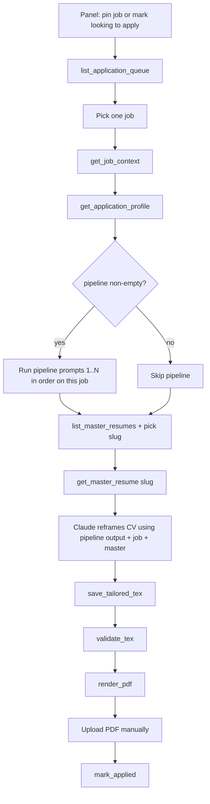

# MCP application assistant (v0)

**Last updated:** 2026-07-01

Plan and reference for the `relocation_jobs/mcp/` domain: a local MCP server for **Claude Desktop** that prepares tailored resume PDFs for jobs on the panel. v0 does **not** submit applications automatically and does **not** use the Claude API — Claude Desktop (subscription) does the resume reframing in chat; this app supplies data, validation, PDF rendering, and board state updates.

**Private data is stored in Postgres per user — nothing sensitive is committed to git.**

Use the panel **Application data** page at `/apply` (also linked from the account menu) to edit your profile, **pipeline prompts**, and master resumes in the browser. Claude Desktop MCP tools read the same data for the configured MCP user (`MCP_USERNAME` / `MCP_USER_ID` env).

Related: [architecture.md](architecture.md), [business-rules.md](business-rules.md), [contributing.md](../contributing.md).

---

## Goals (v0)

| In scope | Out of scope (later) |
|----------|----------------------|
| MCP tools for job context, queue, multi-master resumes | Headless Claude API orchestration |
| Master `.tex` + tailored `.tex` per job in DB | Browser auto-submit (Playwright) |
| Deterministic validation before PDF render | ATS-specific form fillers |
| Local LaTeX → PDF (`tectonic` / `pdflatex`) | Batch unattended apply |
| `mark_applied` via existing `positions` service | JD fetch / keyword scoring |

---

## Architecture

```text
Claude Desktop
        ▼
scripts/mcp_server.py  (stdio MCP)
        ▼
relocation_jobs/mcp/
  server.py      MCP tools
  service.py     Orchestration (no SQL)
  repo.py        Postgres
  validate.py    Structure + fact checks vs master
  render.py      LaTeX compile (temp dir)
        │
        ├── catalog/repo
        ├── positions/service
        └── users/repo
```

---

## Database schema

Migrations: `mcp_tables_v1`, `mcp_master_resumes_v2`.

### `mcp_master_resumes`

| Column | Purpose |
|--------|---------|
| `user_id` + `slug` | PK — e.g. `go`, `java`, `fullstack` |
| `label` | Display name |
| `content` | Master `.tex` |

### `mcp_user_documents`

Profile (`profile_json`), including optional `pipeline` — up to 5 ordered prompt strings run before resume reframing.

### `mcp_applications`

| Column | Purpose |
|--------|---------|
| `master_resume_slug` | Variant used for this application |
| `tailored_tex`, `pdf_bytes`, `meta_json` | Application artifacts |

---

## MCP tools

| Tool | Purpose |
|------|---------|
| `get_job_context` | Job + tracking + `master_resume_slug`, `has_tailored_tex` / `has_pdf` |
| `list_application_queue` | Pinned + looking-to-apply jobs |
| `list_master_resumes` | All master variants |
| `get_master_resume` / `save_master_resume` | Read/write master tex by slug |
| `get_mcp_status` | Debug: MCP user + profile/resume presence + `pipeline_prompt_count` |
| `get_application_profile` / `save_application_profile` | Profile fields; `pipeline` array on profile |
| `get_reframe_pipeline` | Ordered pipeline prompts only (alias of profile.pipeline) |
| `save_tailored_tex` | Requires `master_resume_slug` |
| `validate_tex` | Structure + fact checks vs master |
| `render_pdf` | Compile → store PDF bytes |
| `mark_applied` | Panel tracking |

### End-to-end flow (position → pipeline → reframe)

One job from queue to tailored PDF. Claude Desktop runs the **pipeline in chat** (not as separate MCP calls); MCP supplies the job, profile, prompts, and master tex.



#### 0. One-time setup (`/apply`)

1. Save **master resume(s)** (e.g. `go`, `java`).
2. Save **application profile** (name, email, …).
3. Add up to **5 pipeline prompts** in order (Profile → Pipeline). Example:
   - *Read the job title and URL context; list the top skills the role likely needs.*
   - *Map my master resume experience to those skills; note gaps.*
   - *Reframe the resume bullets to emphasize matches; do not invent employers or dates.*

#### 1. Pick a position

**Option A — from queue**

```text
list_application_queue(country="uk")   # optional country filter
```

Returns pinned and looking-to-apply jobs with `country`, `company`, `url`, `title`.

**Option B — you already know the job**

Use `country`, `company`, and `url` from the panel board.

#### 2. Load job context

```text
get_job_context(country, company, url)
```

Use `title`, `ats_url`, flags (`looking_to_apply`, `pinned`), and whether tailored tex/PDF already exist.

#### 3. Load profile and pipeline prompts

```text
get_reframe_pipeline()
```

or

```text
get_application_profile()   # pipeline is a field on the response
```

**There is no `run_pipeline` tool.** Pipeline prompts are stored in Postgres and returned by the tools above. Claude must run each string in `pipeline[]` **in order in chat** before reframing `.tex`.

Example `get_reframe_pipeline()` response:

```json
{
  "pipeline": [
    "List the top 5 skills this role needs.",
    "Map my experience to those skills.",
    "Reframe the resume emphasizing matches without new facts."
  ],
  "count": 3,
  "run_in_order": true
}
```

Quick sanity check: `get_mcp_status()` → `pipeline_prompt_count` (count only, not text).

#### 4. Run the pipeline (in Claude chat)

For each string in `pipeline[0]`, `pipeline[1]`, … **in order**:

1. Apply that instruction to **this job** (use `get_job_context` output + job URL if needed).
2. Keep the output of each step as context for the next.
3. Do **not** reframe the `.tex` until the last pipeline step (unless a prompt explicitly says to).

Pipeline runs in Claude’s reasoning — there is no `run_pipeline` MCP tool. Use `get_reframe_pipeline` or `get_application_profile().pipeline`.

#### 5. Reframe the CV

```text
list_master_resumes()
get_master_resume("<slug>")    # e.g. go
```

Using pipeline outputs + job context + master `.tex`, produce tailored LaTeX. Facts must stay within the master (no new employers/years).

#### 6. Save, validate, render

```text
save_tailored_tex(country, company, url, content, master_resume_slug="go")
validate_tex(country, company, url, master_resume_slug="go")
render_pdf(country, company, url, master_resume_slug="go")
```

Fix validation issues and re-save if needed.

#### 7. After applying

Upload the PDF to the ATS manually, then:

```text
mark_applied(country, company, url, applied=true)
```

#### Paste into Claude Desktop

```text
Apply to the first job in my UK queue:
1. list_application_queue(country="uk") and pick one job
2. get_job_context for that job
3. get_reframe_pipeline — run each prompt in pipeline[] in order for this job (not a separate run tool)
4. get_master_resume for the best matching slug
5. Reframe the CV from the master using pipeline results
6. save_tailored_tex, validate_tex, render_pdf
Stop if validate_tex fails and show me the issues.
```

### Workflow (short)

1. Setup on `/apply`: master resumes + profile + pipeline prompts.
2. Pin job or mark **looking to apply** on the panel.
3. `list_application_queue` → `get_job_context` → `get_application_profile` → run `pipeline` in order → `get_master_resume` → reframe.
4. `save_tailored_tex` → `validate_tex` → `render_pdf`.
5. Upload PDF manually → `mark_applied`.

---

## Validation

1. **Structure** — document env, balanced `\begin`/`\end`, max 400 lines.
2. **Facts** — no new years or employers vs the chosen master resume.

---

## Configuration

| Variable | Default | Purpose |
|----------|---------|---------|
| `MCP_USERNAME` | `admin` | Panel user |
| `MCP_USER_ID` | (unset) | Override user id |
| `MCP_LATEX_CMD` | `tectonic` | LaTeX binary |
| `DATABASE_URL` | (required) | Same as panel |

### Troubleshooting

**Profile or resumes look empty / null in Claude**

1. Call `get_mcp_status` — shows which panel user MCP reads (`user_id`, `username`) and whether profile / master resumes exist.
2. MCP defaults to `MCP_USERNAME=admin`. Data saved on `/apply` is per **logged-in panel user**. If you sign in as a different account, set `MCP_USERNAME` (or `MCP_USER_ID`) in Claude Desktop’s MCP server `env` to match.
3. Ensure Claude Desktop’s MCP config includes the same `DATABASE_URL` as the panel (`.env` is loaded from the repo root by `scripts/mcp_server.py`, but explicit `env` in the config is clearer).

**Claude says there is no pipeline tool**

Correct: there is no `run_pipeline` tool. Prompts are **data**, not an executable tool.

1. Call **`get_reframe_pipeline`** (or **`get_application_profile`** and read the `pipeline` field).
2. Run each string in `pipeline[]` **in order in chat** before `get_master_resume` / reframing.
3. Restart Claude Desktop (or reload MCP) after server updates so `get_reframe_pipeline` appears in the tool list.

**`get_job_context` shows `null` for `visa_sponsorship` or `ats_score`**

Normal when the catalog or your tracking has no value for those fields.

---

## Tests

```bash
pytest tests/mcp -o addopts=
```

---

## Package layout

```text
relocation_jobs/mcp/
  repo.py
  service.py
  server.py
  validate.py
  render.py
  types.py

scripts/mcp_server.py
tests/mcp/
```
