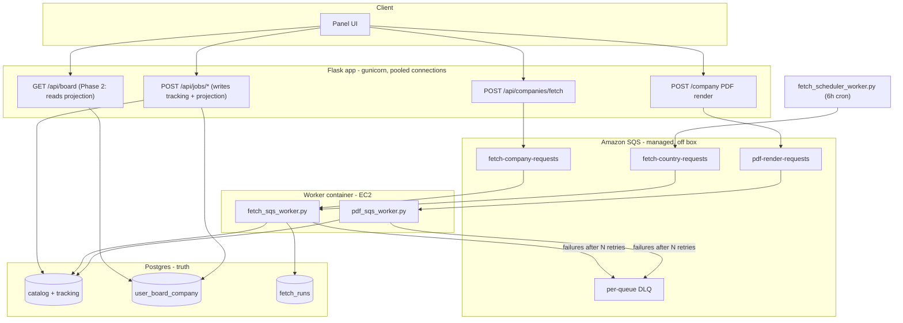
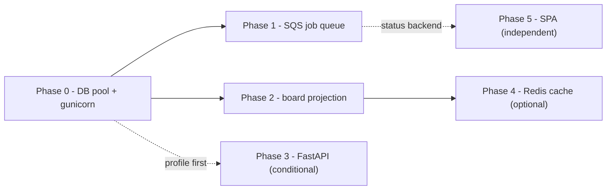

# Multi-user scaling — proposal

**Status:** proposal (broker choice and framework direction decided; implementation not started)
**Last updated:** 2026-07-13
**Authors:** architecture discussion (agent + owner)

Related: [architecture.md](architecture.md), [rules.md](rules.md), [kafka-fetch-pipeline-proposal.md](kafka-fetch-pipeline-proposal.md) (superseded broker choice — see below), [board-read-model-proposal.md](board-read-model-proposal.md), [ec2-panel.md](../operations/ec2-panel.md), [aws-postgres.md](../operations/aws-postgres.md)

---

## Summary

The app has one real user today. Scaling to many concurrent users exposes bottlenecks that don't matter at n=1: a single shared Postgres connection serializing all HTTP threads, per-request board re-flattening, and — the trigger for this proposal — **per-user job submission** (company fetch, PDF/LaTeX compile) sharing global mutexes or blocking request threads with no queue, retry, or DLQ.

**Recommended direction:** three independent workstreams, in priority order:

1. **Phase 0 — DB connection pool + gunicorn worker tuning.** No new infra. Prerequisite for everything else.
2. **Phase 1 — Amazon SQS** for per-user job queueing (company fetch requests, PDF compiles). Chosen over Redis Streams, Celery+Redis, RabbitMQ, and Kafka/MSK because it is fully managed (zero RAM/CPU cost on the EC2 box) and has a **permanent** free tier (1M requests/month), while the box stays `t4g.micro`.
3. **Phase 2 — Board read model projection** (`user_board_company` table), independent of Phase 1, fixes the O(n) flatten-per-request problem.

**Framework decision:** stay on sync Flask. Do not adopt Quart (stagnant: 0 releases in 2025, last release Dec 2024). Do not adopt FastAPI speculatively — only revisit async web if profiling after Phases 0–2 shows the sync request/response cycle itself, not DB contention, is the ceiling.

**Not recommended:** Kafka/MSK (no AWS free tier, managed minimum ~$460–550/mo); RabbitMQ (new container, real RAM tax on a 1GB box); Redis Streams/Celery for this use case (would still add load to the same constrained box when a $0 off-box option exists); Elasticsearch for board; NoSQL for catalog/tracking; client-authoritative board state; Redis-first mutations (see board-read-model-proposal.md).

**Decision needed:** none blocking — broker (SQS) and framework (stay sync Flask, FastAPI conditional) are decided. Remaining open items are sequencing and sizing, listed at the end.

---

## Problem statement

### What breaks first with more than one real user

| # | Bottleneck | Location | Why it's fine at n=1, not at scale |
|---|------------|----------|--------------------------------------|
| B1 | Single shared Postgres connection on the main thread | `core/db.py` — `_pg_conn` + `_db_lock` (RLock) | Gunicorn's 8 threads all serialize on one Python-level lock for every DB query, even though Postgres itself can hold 100+ connections |
| B2 | Board flatten is O(visible companies) per request | `panel/service.py` `flatten_companies_page()`, `sort=newest` path | One user's board load flattens the whole catalog once; N concurrent users on a 400-company country = N full re-flattens per page load |
| B3 | Sync Flask routes block worker threads for the full request | `web/server.py` (no `async def` routes) | Fine when nobody else is waiting; a slow DB query or compile ties up one of only 8 threads |
| B4 | Company fetch and PDF compile share global mutexes / block request threads | `fetch/runner.py` (`fetch_runs.status == 'running'` mutex), PDF/tectonic compile route | With one user, a fetch or compile never collides with anything. With many users, one person's `POST /api/companies/fetch` (or the 6h scheduler) blocks everyone else's; PDF compile is CPU-bound and runs inline on the request thread |
| B5 | Fetch progress is in-memory, not durable | `fetch/state.py` module-level dict | A crash mid-fetch loses per-company progress; orphan rows get marked failed on restart instead of resumed |
| B6 | 1 gunicorn worker = 1 CPU core used | `docker-entrypoint.sh` (`--workers 1 --threads 8`) | `t4g.micro` has 2 vCPUs; only one is ever used for HTTP |
| B7 | No connection pooling anywhere | `core/db.py` — raw `psycopg.connect()` per thread | No backpressure, no graceful degradation, just more raw connections as load grows |
| B8 | Four separate vanilla JS SPAs each with their own auth flow | `static/js/main.js`, `admin.js`, `apply.js`, `company.js` | Inconsistent error handling under load; not a scaling blocker per se, but a multi-user UX risk |
| B9 | No retry/DLQ for fetch or PDF failures | `company_fetch_attempts` (logged, never retried) | Fine to fix by hand for one user; not viable once many users are submitting jobs concurrently |

**The trigger for this proposal specifically is B4** — per-user job submission with no queue. The 6-hour country fetch scheduler (`fetch/scheduler.py`) is a singleton batch cron with no multi-user contention by itself; it becomes a contention problem only because it shares the same global mutex that user-triggered company fetches and PDF compiles use.

---

## Options considered — message broker

Evaluated against this project's actual constraint: EC2 `t4g.micro` (2 vCPU, ~1GB RAM), staying at that size, already running Postgres + Redis + panel + fetch worker containers.

### A. Redis Streams (reuse existing Redis)

| Pros | Cons |
|------|------|
| Already deployed (`relocation-redis`), already a dependency (`redis>=5.0.0`) | Adds queue load to the same memory-constrained box |
| Native consumer groups (`XREADGROUP`) | Retry/DLQ (`XPENDING`/`XCLAIM`) must be hand-rolled |
| No new infra to provision | No AWS-managed durability guarantees |

### B. Celery + Redis broker

| Pros | Cons |
|------|------|
| Mature task/retry/status ergonomics, well-known in Python | Still runs on the same box's Redis — same memory pressure as A |
| No AWS lock-in | Heavier framework surface than needed for two job types |

### C. RabbitMQ

| Pros | Cons |
|------|------|
| Best-in-class broker semantics (native DLQ, priority queues, management UI) | New container; realistic baseline ~256MB+ RAM — a real tax on a 1GB box |
| No vendor lock-in | New service to patch, monitor, restart-policy |

### D. Kafka / AWS MSK

| Pros | Cons |
|------|------|
| Industry-standard for high fan-out, multi-consumer, replay | **No AWS free tier at all.** MSK Provisioned minimum ~$460/mo (3 brokers); MSK Serverless ~$550+/mo in cluster-hours alone before data charges |
| | Self-hosting Kafka on the box is not viable either — JVM heap alone wants 1GB+, starving Postgres/Redis/panel/worker |

**Verdict:** reject for this project's scale and budget.

### E. Amazon SQS (recommended)

| Pros | Cons |
|------|------|
| **Fully managed — zero RAM/CPU cost on the EC2 box** | AWS vendor lock-in (`boto3`, IAM) |
| **Permanent free tier: 1M requests/month**, not a 12-month trial, applies across Standard/FIFO/Fair queues | Network hop to AWS API per enqueue/dequeue (not local-socket fast) |
| Native retry (visibility timeout) and DLQ (redrive policy) | Local dev/tests need a mock (`moto` or `localstack`) since there's no broker to run locally |
| Already on AWS (EC2, EIP, security groups) — one more IAM-scoped resource, not a new platform | |

### Decision: broker choice

**SQS.** Given the explicit constraint of staying on `t4g.micro`, any broker that runs on-box (Redis Streams, Celery+Redis, RabbitMQ) adds memory pressure the project is trying to avoid; any broker with real durability/fan-out guarantees that also costs money (Kafka/MSK) is not affordable at this budget. SQS is the only option that is simultaneously **$0** and **off-box**.

This **supersedes** the broker recommendation in [kafka-fetch-pipeline-proposal.md](kafka-fetch-pipeline-proposal.md) (which considered status quo / Postgres queue / Redis Streams / Kafka, but not SQS, and was written before the memory-constraint discussion below). That doc's problem statement (fetch pipeline coordination) is still accurate; its options table should be read alongside this one, not in place of it.

---

## Options considered — web framework for async routes

### A. Stay sync Flask (recommended for now)

| Pros | Cons |
|------|------|
| Zero migration cost | Sync routes tie up gunicorn threads for full request duration |
| Actively maintained, huge ecosystem | Ceiling exists (8 threads today, tunable via Phase 0) |
| Connection pool (Phase 0) already fixes the worst of the DB-contention symptom | |

**Verdict:** correct starting point. YAGNI — prove the ceiling is real before rewriting.

### B. Quart

| Pros | Cons |
|------|------|
| API mirrors Flask closely, smaller migration diff than FastAPI | **Stagnant**: last release 0.20.0 Dec 2024, zero releases in 2025, ~14 commits all year (mostly typo/logo fixes), still "Beta" on PyPI |

**Verdict:** reject. Not worth building new infrastructure on a framework with this little active maintenance.

### C. FastAPI (conditional, later)

| Pros | Cons |
|------|------|
| Actively maintained, ASGI-native, huge ecosystem | Real rewrite — different app object, route decorators, and validation flow than Flask; not a drop-in |

**Verdict:** correct target **if** async web is ever justified by data, not assumption.

### Decision: framework choice

Stay on sync Flask through Phase 0–2. Re-evaluate only after load-testing: if p95 latency is dominated by DB/query wait time, Phase 0 (pool) + Phase 2 (projection) already fix it — stop there. If p95 is dominated by thread exhaustion on the sync request/response cycle itself, then start a FastAPI migration as its own scoped project.

---

## Proposed architecture



---

## Phased rollout

### Phase 0 — Foundation fixes (no new infra)

Prerequisite for Phase 1 and Phase 2.

| Change | File(s) | Why |
|--------|---------|-----|
| Replace shared main-thread connection with a real pool (`psycopg_pool.ConnectionPool`) | `core/db.py` | 8 gunicorn threads each get a pooled connection instead of serializing on one lock |
| Bump gunicorn `--workers` to 2 (matches `t4g.micro` 2 vCPUs) | `docker-entrypoint.sh` | Use both cores without overcommitting a 1GB box |
| Initialize the pool after fork, one pool per worker process | `docker-entrypoint.sh`, `web/server.py` | Avoid sharing one connection object across forked workers |
| Remove `_IDLE_PING_THRESHOLD` idle-ping logic | `core/db.py` | Was a Neon-serverless workaround; unneeded on always-on EC2 Postgres |

**Risk:** pool sizing on a 1GB box. Start conservative: `min_size=2, max_size=8` per worker × 2 workers = up to 16 connections — matches the connection count the fetch worker already produces today without issue.

**Test:** `pytest tests -o addopts=` must stay green; existing DB test mocks already abstract connection acquisition.

### Phase 1 — SQS-backed job queue

Decouple "user submitted a fetch/PDF job" from "job executes," with durable retry/DLQ, at zero infra cost on the box.

**Queues:**

| Queue | Producer | Consumer | Payload |
|-------|----------|----------|---------|
| `fetch-company-requests` | `POST /api/companies/fetch` | `fetch_sqs_worker.py` | `{run_id, country, company_name}` |
| `fetch-country-requests` | Admin fetch UI, `fetch_scheduler_worker.py` (6h cron) | `fetch_sqs_worker.py` | `{run_id, country, concurrency}` |
| `pdf-render-requests` | Company workspace "Re-render PDF", MCP tailored CV | `pdf_sqs_worker.py` | `{user_id, company, position_slug}` |
| `*-dlq` (one per queue above) | SQS redrive policy, `maxReceiveCount=3` | Manual review / admin dashboard | same as source |

**New code:**

```
relocation_jobs/
├── core/
│   └── sqs_client.py          # boto3 SQS client, gated by env vars (mirrors redis_client.py pattern)
├── fetch/
│   ├── runner.py              # enqueue instead of thread spawn; still creates fetch_runs row
│   └── scheduler.py           # enqueue one country message per 6h cycle instead of blocking wait
scripts/
├── fetch_sqs_worker.py        # long-poll fetch-company/fetch-country queues, run pipeline, delete on success
└── pdf_sqs_worker.py          # long-poll pdf-render-requests, run tectonic, delete on success
```

**Changes to existing code:**

| File | Change |
|------|--------|
| `fetch/runner.py` | `start_company_fetch()` / `start_country_fetch()` send an SQS message with `run_id` + payload, return immediately |
| `fetch/scheduler.py` | `run_fetch_cycle()` enqueues one message per country instead of blocking `wait_for_fetch_thread()` |
| `fetch/state.py` | Progress comes from `fetch_runs` (Postgres) + worker updates, not an in-process dict |
| `fetch/repo.py` | Add helpers for the worker to update `fetch_runs` status/progress |
| `web/routes/fetch.py` | `POST /api/companies/fetch` and admin `POST /api/fetch` enqueue and return `202 { run_id }` |
| `web/routes/company.py` (PDF route) | Enqueues, returns `202`; client polls existing status pattern |
| `Dockerfile.ec2-worker` | CMD becomes the SQS worker script(s); keep Playwright/Chromium deps for fetch |

**Deploy changes:**

- IAM role/user scoped to the specific queue ARNs only (least privilege).
- `SQS_FETCH_COUNTRY_QUEUE_URL`, `SQS_FETCH_COMPANY_QUEUE_URL`, `SQS_PDF_QUEUE_URL` env vars — explicit, no magic discovery.
- Redrive policy `maxReceiveCount=3` → DLQ per queue.
- No new container needed for the broker itself — SQS is managed and off-box by design.

**Secrets:** AWS credentials for SQS go in gitignored `.env`/`aws-postgres.env` only. Queue URLs use placeholders (`<SQS_QUEUE_URL>`) in any committed docs, per this repo's [secrets rule](rules.md#secrets-and-documentation).

### Phase 2 — Board read model projection (independent of Phase 1)

Fixes B2. Full design already exists in [board-read-model-proposal.md](board-read-model-proposal.md) Option F — this proposal adopts it as-is:

- New table `user_board_company` (`user_id, country, company_id, sort_ts, row_json, updated_at`).
- Write path: tracking mutation commits → `refresh_company_projection()` in the same transaction.
- Read path: `GET /api/board` becomes a keyset-paginated `SELECT` against the projection, no per-request flatten.
- Catalog sync (`sync_company_board_to_catalog`) enqueues an SQS message (or sets a lazy-stale flag) so projection refresh for affected users happens asynchronously, not inline.

### Phase 3 (conditional, later) — FastAPI

Not scheduled. Gate: after Phases 0–2 ship, load-test with realistic concurrent users. Only start this if p95 latency is dominated by thread exhaustion rather than DB/query wait time.

### Phase 4 (optional accelerator) — Redis board read cache

Option G from [board-read-model-proposal.md](board-read-model-proposal.md) — ZSET rank + HASH row cache in front of the Phase 2 projection. Only after Phase 2 is stable and profiling shows Postgres reads are still hot.

### Phase 5 (independent) — Frontend SPA

Covered by [full-spa-ui-modernization-proposal.md](full-spa-ui-modernization-proposal.md). Fixes B8. Can start any time; benefits from Phase 1's job-status backend for fetch/PDF progress polling or SSE.

---

## Dependency graph



---

## What we explicitly will not do

| Approach | Why reject |
|----------|------------|
| Kafka / MSK | No AWS free tier; managed minimum ~$460–550/mo; self-hosting starves the box |
| RabbitMQ | New container + real RAM tax on a box staying at `t4g.micro` |
| Quart | Stagnant since Dec 2024 (0 releases in 2025) |
| Redis Streams / Celery for this use case | Would work, but adds load to the same constrained box when a $0 off-box option (SQS) exists |
| Redis-first mutations (async DB writes) | [board-read-model-proposal.md](board-read-model-proposal.md) rejects this: Postgres writes must commit before UI response |
| Elasticsearch for board | New ops surface; merge semantics stay in Python; `pg_trgm` first if text search is ever needed |
| NoSQL for catalog + tracking | Postgres already fits the shared-catalog + per-user-overlay pattern ([catalog-pattern.md](catalog-pattern.md)) |
| Client-authoritative board state | Pagination + sort cascade impossible to derive from a 25-row page |
| FastAPI rewrite upfront | Real migration cost; only justified by profiling data |
| TypeScript mid-SPA-migration | Adds friction during the rewrite ([full-spa-ui-modernization-proposal.md](full-spa-ui-modernization-proposal.md)) |

---

## Effort estimate

| Phase | Effort | Risk | Ships value |
|-------|--------|------|--------------|
| Phase 0 — Foundation | 2-3 days | Low | Unblocks concurrent DB access immediately |
| Phase 1 — SQS job queue | 1-2 weeks | Medium | Per-user fetch/PDF requests stop blocking each other; durable retry/DLQ |
| Phase 2 — Board projection | 2-3 weeks | Medium | Sub-200ms board reads regardless of user count |
| Phase 3 — FastAPI (conditional) | 2-4 weeks if triggered | Medium-High | Only if profiling proves sync Flask is the ceiling |
| Phase 4 — Redis cache (optional) | 1-2 weeks | Low-Medium | Sub-20ms board reads |
| Phase 5 — SPA | 6-7 weeks | Medium | Single maintainable frontend |

---

## Open questions

1. **PDF worker placement** — separate small container, or same worker process running both fetch and PDF consumers in separate threads? Leaning toward the latter given the box constraint; revisit if PDF compile volume grows.
2. **SQS FIFO vs Standard** — Standard is cheaper and simpler; FIFO guarantees order but at 3x cost and lower throughput. Fetch/PDF jobs are naturally idempotent per `(run_id, company)` or `(user_id, position)`, so Standard + idempotent handlers should suffice — confirm during Phase 1 design.
3. **Local dev / test mocking** — `moto` (in-process AWS mocks) vs `localstack` (Docker container) for SQS in `pytest`. `moto` is lighter and matches the "in-memory Postgres mock only" testing philosophy already used in `tests/`.
4. **DLQ visibility** — admin dashboard panel to view/replay dead-lettered jobs, or CLI script (`scripts/replay_dlq.py`) for now?

---

## Done when

- [ ] Phase 0 shipped: connection pool + gunicorn workers=2; `pytest tests -o addopts=` green
- [ ] Phase 1 shipped: `core/sqs_client.py`, 3 queues + DLQs provisioned, `fetch/runner.py` and `fetch/scheduler.py` enqueue instead of thread-spawn, PDF route enqueues, worker script(s) running on EC2
- [ ] Phase 1 tests: enqueue → worker processes → catalog/PDF output correct; DLQ receives after 3 failures
- [ ] Load test with realistic concurrent users informs whether Phase 3 (FastAPI) is warranted
- [ ] Phase 2 tracked separately per [board-read-model-proposal.md](board-read-model-proposal.md) done-when checklist
- [ ] `docs/backlog.md` updated to reflect this decision (see cross-reference)
